# EvalOS Framework

> **A multi-agent evaluation framework for agentic search systems** — designed to continuously measure, diagnose, and generate training signals for production search pipelines like Firecrawl.

EvalOS closes the feedback loop between search output quality and model improvement. It does this through a fully automated pipeline: dynamically generated adversarial test cases → P1/P2 multi-agent judging → structured RL training signal export → cross-run improvement analysis. Every component is observable through a real-time web dashboard.

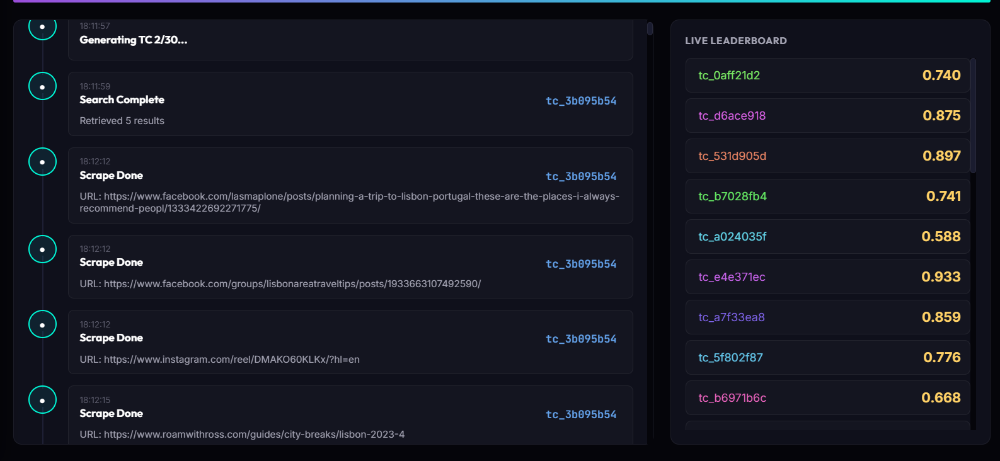

---

## Table of Contents

1. [System Overview](#system-overview)
2. [Architecture](#architecture)
3. [Core Design Principles](#core-design-principles)
4. [Pipeline Execution Flow](#pipeline-execution-flow)
5. [Module Reference](#module-reference)
   - [Entry Point — `run.py`](#entry-point--runpy)
   - [Configuration — `config.py`](#configuration--configpy)
   - [Web Dashboard — `app.py`](#web-dashboard--apppy)
   - [Agent 1 — Test Generator](#agent-1--test-generator-evaltestgeneratorpy)
   - [Agent 2 — P1/P2 Multi-Agent Judge](#agent-2--p1p2-multi-agent-judge-evaljudgepy)
   - [Agent 3 — Improvement Agent](#agent-3--improvement-agent-evalimprovement_agentpy)
   - [Scoring System](#scoring-system)
   - [RL Signal Generation](#rl-signal-generation)
   - [Knowledge Base — Qdrant + BGE-M3](#knowledge-base--qdrant--bge-m3)
   - [Regression Detection](#regression-detection)
   - [Ranking Comparator](#ranking-comparator)
6. [Data Models](#data-models)
7. [Output Structure](#output-structure)
8. [Configuration Reference](#configuration-reference)
9. [Running the Pipeline](#running-the-pipeline)
10. [Dashboard Walkthrough](#dashboard-walkthrough)
11. [Extending the System](#extending-the-system)
12. [Known Issues & Planned Improvements](#known-issues--planned-improvements)

---

## System Overview

EvalOS evaluates a **search + scrape pipeline** (specifically Firecrawl) from the perspective of an agentic AI system that relies on it for retrieval. Queries are not simple user questions — they are intentionally adversarial queries modelled after real failure patterns that agentic systems produce when searching the web.

Each evaluation run:

1. **Generates** N test cases, each with its own bespoke scoring rubric and an assigned chaos archetype
2. **Fires** each query at the Firecrawl search and scrape API
3. **Evaluates** the results through a two-tier multi-agent judge (P1 per-document profiling, then P2 dimension scoring)
4. **Diagnoses** each test case for root causes, generates per-URL quality annotations, and proposes query reformulations
5. **Exports** 7 types of RL training signals derived from the evaluation
6. **Synthesizes** cross-run improvement proposals through a Level-2 Improvement Agent
7. **Detects** regressions against prior runs and builds a full run report

Everything is streamed live to the dashboard via Server-Sent Events. Runs persist to disk and are browsable across sessions.

---

## Architecture

```
┌─────────────────────────────────────────────────────────────────────────┐
│                          EvalOS Entry Points                            │
│                                                                         │
│   python run.py           (Web mode — FastAPI + auto browser open)      │
│   python run.py --cli     (CLI mode — full pipeline in terminal)        │
│   python run.py --cli --cases 5   (Quick smoke test)                    │
└────────────────────────────────┬────────────────────────────────────────┘
                                 │
                    ┌────────────▼────────────┐
                    │   Orchestrator          │
                    │   pipeline/orchestrator │
                    └────────────┬────────────┘
                                 │
           ┌─────────────────────┼──────────────────────┐
           │                     │                      │
    ┌──────▼──────┐     ┌────────▼────────┐    ┌───────▼───────┐
    │ TestGenerator│     │  Two-Layer Cache│    │ FirecrawlPool │
    │ (LLM-A)      │     │                 │    │ search+scrape │
    │              │     │ L1: Query Cache │    │ round-robin   │
    │ Novel (65%)  │     │  Qdrant cosine  │    └───────────────┘
    │ CacheVar(35%)│     │  sim ≥ 0.95     │
    └──────────────┘     │                 │
                         │ L2: KB Hybrid   │
                         │  BM25+Vector    │
                         │  RRF score≥0.08 │
                         └────────────────┘
                                 │
                    ┌────────────▼──────────────────┐
                    │   P1/P2 Multi-Agent Judge      │
                    │                               │
                    │  ┌─────────────────────────┐  │
                    │  │ P1 Agent × N (per URL)  │  │
                    │  │ Document Intelligence   │  │
                    │  │ Profiler — extracts:    │  │
                    │  │  · scrape verdict       │  │
                    │  │  · key claims           │  │
                    │  │  · named entities       │  │
                    │  │  · temporal markers     │  │
                    │  │  · authority signals    │  │
                    │  │  · structural metrics   │  │
                    │  └──────────┬──────────────┘  │
                    │             │ P1Results         │
                    │  ┌──────────▼──────────────┐  │
                    │  │ P2 Agents × 5 (per dim  │  │
                    │  │ family, concurrent)     │  │
                    │  │  · Ranking              │  │
                    │  │  · Coverage             │  │
                    │  │  · Authority            │  │
                    │  │  · Freshness            │  │
                    │  │  · Precision            │  │
                    │  │ + Fidelity (deterministic│  │
                    │  │   from P1 scrape scores)│  │
                    │  └─────────────────────────┘  │
                    └────────────┬──────────────────┘
                                 │ EvalResult
           ┌─────────────────────┼────────────────────┐
           │                     │                    │
    ┌──────▼──────┐   ┌──────────▼────────┐   ┌──────▼──────┐
    │ Improvement  │   │ SignalGenerator   │   │ReportBuilder│
    │ Agent (LLM-C)│   │ 7 RL signal types │   │+ Regression │
    │ Level 1: TC  │   │                   │   │  Detector   │
    │ Level 2: Run │   └───────────────────┘   └─────────────┘
    └──────────────┘
           │
    ┌──────▼──────────────────────────────────────┐
    │  Qdrant + BGE-M3 Knowledge Base             │
    │  Dense (1024d) + Sparse (BM25-lex) RRF      │
    │  firecrawl_eval  +  firecrawl_query_cache   │
    └─────────────────────────────────────────────┘
```

---

## Core Design Principles

### 1. Chaos-Driven Generation
Every test case is assigned a **chaos archetype** that simulates a known failure mode of agentic search systems. This ensures the evaluation covers realistic degradation scenarios, not just clean benchmark queries.

### 2. Rubric-First Test Design
The test generator authors a **custom scoring rubric** for each test case before writing the query. Rubric dimensions (2–4 per TC) define exactly what success and failure look like for that specific query. The judge never uses hardcoded criteria.

### 3. Rolling History + Duplicate Avoidance
Test cases are persisted across runs to a JSONL history file. The generator uses Jaccard similarity (`< 0.65`) to reject near-duplicate queries before they are added, ensuring each run extends coverage rather than repeating it.

### 4. Cache Variant Testing
Once sufficient history accumulates (≥ 5 cases), 35% of new test cases are **cache variants** — derived from prior test cases to test how the pipeline handles queries that share a source, intent, or phrasing with a previously cached result.

### 5. Two-Layer Content Cache
The pipeline uses a two-layer cache before calling Firecrawl's scrape API:
- **L1 (Query Cache)**: A Qdrant vector collection storing search result lists keyed by dense query embedding. Hit threshold: cosine similarity ≥ 0.95, TTL: 1 hour.
- **L2 (KB Semantic Cache)**: Per-URL hybrid RRF (BM25 + vector) scoring against the content knowledge base. If the query-specific RRF score for a URL exceeds the threshold (default 0.08), the cached full document is returned instead of re-scraping. TTL: 15 minutes (configurable).

### 6. P1/P2 Multi-Agent Judging
Evaluation is split into two tiers. P1 handles per-document fact extraction. P2 handles holistic dimension scoring against the rubric using P1's structured output. This separation means the reasoning LLM (P2) never has to process raw HTML/markdown — it works entirely from structured profiles.

### 7. 5-Step Chain of Thought Scoring
Every P2 dimension evaluation follows a locked 5-step CoT: evidence collection → criteria checklist → contrastive fail check → level assignment with justification → precise score within level band.

### 8. Hybrid Pass Gate
A test case only passes if: **overall score ≥ `pass_threshold` AND no dimension scores below `dimension_floor`**. A single critical failure on any dimension fails the test case even if the overall average is acceptable.

### 9. Concurrent Non-Blocking Architecture
- P1 agents run concurrently per URL (`asyncio.gather`)
- P2 agents run concurrently per dimension family (`asyncio.gather`)
- Post-judge pipeline (diagnosis → RL signals → per-TC report) runs as a background task
- Next TC generation overlaps with current TC execution
- BGE-M3 embedding is serialized with a semaphore (not thread-safe), but all other I/O is concurrent

---

## Pipeline Execution Flow

```
for i in range(num_test_cases):
    ┌─ CONCURRENT ────────────────────────────────────────┐
    │  Process TC[i]:                                     │
    │   1. L1 Query Cache lookup (Qdrant vector search)   │
    │   2. Firecrawl search (on cache miss)               │
    │   3. L2 KB Hybrid RRF lookup per URL                │
    │   4. Firecrawl scrape (on KB miss/stale)            │
    │   5. Background indexing to Qdrant KB               │
    │   6. P1 Agents × N (concurrent, per URL)            │
    │   7. P2 Agents × 5 (concurrent, per dim family)     │
    │   8. Fidelity aggregation (deterministic)           │
    │   9. EvalResult → live state + dashboard SSE        │
    │  [Background: Diagnosis → RL signals → TC report]  │
    │                                                     │
    │  Generate TC[i+1] (overlapping):                    │
    │   • LLM-A: domain + archetype + rubric-first query  │
    └─────────────────────────────────────────────────────┘

After all TCs:
  → Wait for all background tasks
  → Aggregate micro-patterns into run-level taxonomy
  → Improvement Agent Level-2 synthesis
  → SFT Gold example selection
  → Save all 7 RL signal files
  → Retrieval comparison against KB
  → Judge health check
  → Regression detection
  → Full run report
  → Persist run to disk
```

---

## Module Reference

### Entry Point — `run.py`

Single entry point for all pipeline modes:

```bash
python run.py                 # Start web dashboard (auto-opens browser at localhost:8000)
python run.py --cli           # Full pipeline run in terminal
python run.py --cli --cases 5 # Quick test with only 5 test cases
```

In web mode, `run.py` starts a Uvicorn/FastAPI server. The dashboard auto-opens in the default browser after 1.5 seconds. In CLI mode, SSE events are drained to stdout with structured log messages.

---

### Configuration — `config.py`

All settings are exposed via environment variables (loaded from `.env`). `EvalConfig.from_env()` reads them at startup.

| Variable | Default | Description |
|----------|---------|-------------|
| `FIRECRAWL_API_KEY_1` … `_5` | — | Firecrawl API keys (rotated) |
| `OPENROUTER_KEY_1` … `_5` | — | OpenRouter API keys (rotated via pool) |
| `QDRANT_URL` | — | Qdrant cluster URL |
| `QDRANT_API_KEY` | — | Qdrant authentication key |
| `QDRANT_COLLECTION_NAME` | `firecrawl_eval` | Primary KB collection name |
| `GENERATOR_MODEL` | `minimax/minimax-m3` | LLM-A: test case generation |
| `P1_MODEL` | `deepseek/deepseek-v4-flash` | P1: per-document extraction |
| `P2_MODEL` | `deepseek/deepseek-v4-flash` | P2: dimension scoring |
| `IMPROVEMENT_AGENT_MODEL` | `z-ai/glm-5.2` | LLM-C: diagnosis + synthesis |
| `GENERATOR_PROVIDERS` | `Parasail,Together,DeepInfra` | Comma-separated OpenRouter provider order for LLM-A |
| `P1_PROVIDERS` | `Baidu,GMICloud,Fireworks` | Provider order for P1 agents |
| `P2_PROVIDERS` | `Baidu,GMICloud,Fireworks` | Provider order for P2 judges |
| `IMPROVEMENT_AGENT_PROVIDERS` | `StreamLake,Novita` | Provider order for LLM-C |
| `NUM_TEST_CASES` | `30` | Test cases per run |
| `SEARCH_RESULTS_PER_QUERY` | `5` | Firecrawl search results per query |
| `SCRAPE_TOP_N` | `5` | URLs to scrape per query |
| `PASS_THRESHOLD` | `0.65` | Minimum overall score to pass |
| `DIMENSION_FLOOR` | `0.40` | No dimension may score below this |
| `SFT_GOLD_THRESHOLD` | `0.85` | Min score for SFT Gold example selection |
| `KB_FRESHNESS_WINDOW` | `900` | Seconds before a KB entry is considered stale |
| `QUERY_CACHE_THRESHOLD` | `0.95` | Cosine similarity threshold for L1 query cache hit |
| `QUERY_CACHE_EVICTION_MAX_AGE` | `3600` | Seconds before query cache entries are evicted |
| `KB_CONTENT_SCORE_THRESHOLD` | `0.08` | Min RRF score for L2 KB semantic cache hit |
| `JUDGE_MAX_RETRIES` | `2` | Retry attempts for P1/P2 agent LLM calls |
| `LLM_READ_TIMEOUT_S` | `3600` | HTTP read timeout for all LLM calls (seconds) |
| `CACHE_VARIANT_MIN_HISTORY` | `5` | Minimum history size before cache variants are generated |
| `ARCHETYPE_WEIGHTS` | See below | Comma-separated `archetype:weight` pairs |

Default archetype weights: `none:0.30, over_decomposed:0.10, keyword_stuffed:0.10, reformulation_drift:0.12, multi_hop_compressed:0.12, temporal_ambiguity:0.13, copy_paste_artifact:0.13`

---

### Web Dashboard — `app.py`

A FastAPI server streaming live pipeline events via SSE. The dashboard serves 7 tabs:

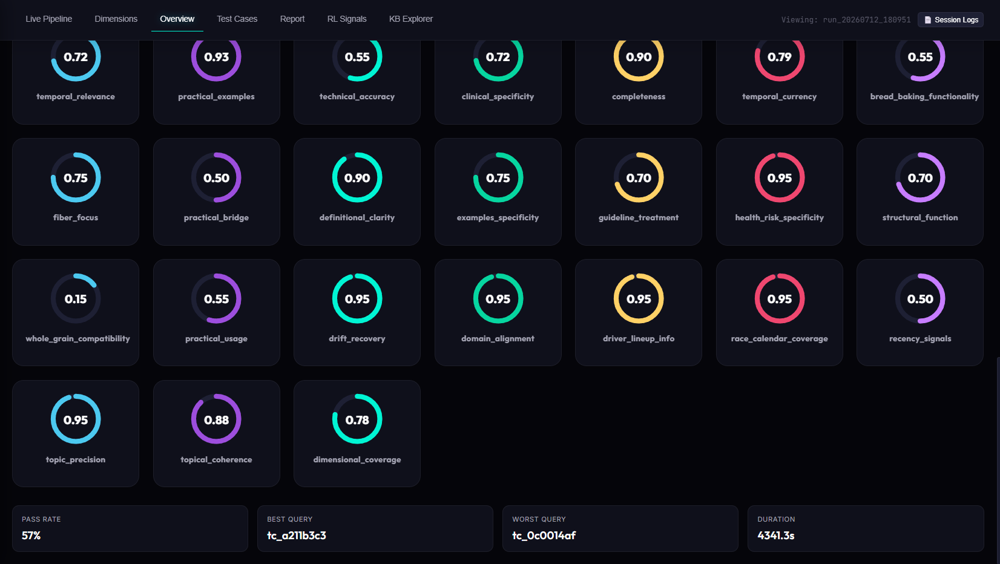

| Tab | What It Shows |
|-----|---------------|
| **Live Pipeline** | Real-time SSE timeline of pipeline events + live leaderboard of TC scores as they complete |
| **Dimensions** | Dynamic rubric dimension cards for the loaded run — name, weight, criteria, and contrastive fail definition |
| **Overview** | Per-dimension gauge rings + pass rate, best/worst query, and run duration stats |
| **Test Cases** | Filterable table with dynamic per-dimension score columns. Click any row to expand the full TC detail |
| **Report** | Rendered markdown report with download button — includes dimension breakdown, floor failures, cache analytics, and improvement proposals |
| **RL Signals** | Sub-tabs for DPO Pairs, Taxonomy, Diagnostics, and Reward Signals |
| **KB Explorer** | Hybrid RRF search against the live Qdrant KB + document/chunk/dedup stats |

**REST API Endpoints:**

| Method | Path | Description |
|--------|------|-------------|
| `GET` | `/api/runs` | List all runs with metadata |
| `GET` | `/api/runs/{run_id}` | Full run payload including dimensions, eval results, and metadata |
| `GET` | `/api/runs/{run_id}/status` | Lightweight status check (status, overall_score, duration_s) |
| `GET` | `/api/runs/{run_id}/report` | Raw markdown report text |
| `GET` | `/api/runs/{run_id}/rl` | RL signals payload |
| `POST` | `/api/run` | Start a new pipeline run (background task) |
| `GET` | `/api/events/{run_id}` | SSE event stream for a run |
| `GET` | `/api/kb/stats` | Knowledge base collection statistics |
| `POST` | `/api/kb/search` | Hybrid RRF search against the KB |

---

### Agent 1 — Test Generator (`eval/test_generator.py`)

**What it creates:** One `TestCase` per call, including a bespoke `EvalRubric`.

**Model:** `GENERATOR_MODEL` (LLM-A), temperature 0.7

#### Agent Chaos Archetypes

Archetypes simulate the specific failure modes that agentic AI systems produce when they issue search queries:

| Archetype | What It Simulates | Expected Failure Mode |
|-----------|-------------------|-----------------------|
| `none` | Clean baseline query, no distortion | N/A — establishes the baseline |
| `over_decomposed` | Agent narrowed or over-simplified the query, losing comparative context | Generic results, misses the compound intent |
| `keyword_stuffed` | Agent dumped all synonyms and related terms into one query | Relevance diluted; noisy aggregator results dominate |
| `reformulation_drift` | Query has drifted from the core intent over multiple retries | Increasingly off-topic results ranked first |
| `multi_hop_compressed` | Multi-step reasoning collapsed into a single query | No single page answers all reasoning hops |
| `temporal_ambiguity` | Uses "latest", "current", or "recent" without a year anchor | Stale content that appears fresh; misleading publication dates |
| `copy_paste_artifact` | Leftover JSON keys, tool call parameters, or prompt fragments in the query | Bizarre keyword matches on technical artifacts rather than content |

Archetype sampling is weighted by `archetype_weights` in config (default skews toward temporal, multi-hop, and copy-paste as these produce the most diagnostic signal).

#### Knowledge Domains

16 domains determine the topical area of each generated test case:

Healthcare, Finance, Legal, Travel, Science, Food & Nutrition, Sports, Education, E-Commerce, Government & Policy, Environment, History, Technology, Cybersecurity, Pharmaceuticals, Real Estate

#### Valid Query Intents

| Intent | Description |
|--------|-------------|
| `factual_lookup` | Single-answer factual question |
| `comparative_research` | Comparing multiple options, products, or approaches |
| `tutorial_howto` | Step-by-step instructions |
| `data_extraction` | Extracting structured data (tables, lists, numbers) |
| `navigational` | Finding a specific known page or resource |
| `exploratory` | Open-ended research without a definitive answer |
| `real_time` | Time-sensitive current information |

#### Two-Phase Generation

**Novel cases (65%):** A single LLM-A call generates:
1. Query (7–15 words, one of 16 domains, one of 7 intents, easy/medium/hard)
2. Rubric with 2–4 custom dimensions — each with `name`, `weight`, `criteria`, and `contrastive_fail`
3. `chaos_archetype` (sampled by weight)

**Cache variants (35%, once history ≥ 5):** Derived from a prior test case in history. Four relationship types with fixed sampling weights:

| Relationship | Weight | What It Tests |
|---|---|---|
| `exact_duplicate` | 10% | Trivial cache hit — minimal evaluation signal |
| `same_source_different_angle` | 35% | Same source material, completely different information angle + rubric |
| `rephrased_same_intent` | 30% | Natural distinct rephrasing of the parent query |
| `subset_of_parent` | 25% | Narrower sub-question targeting a specific detail |

#### Validation Pipeline (per TC)

Before a test case is accepted, it passes a strict multi-step validation:

1. **Schema**: query ≥ 4 words, 2–4 dimensions, weights sum to 1.0, intent from valid list
2. **Semantic**: `contrastive_fail` ≠ copy of `criteria` (Jaccard < 0.70), each criterion ≥ 10 words, no specific named facts/numbers embedded in criteria
3. **Deduplication**: query Jaccard similarity against all history < 0.65
4. **Up to 3 retries** per TC — on failure, the rejection reason is prepended to the next LLM call as an explicit correction signal

---

### Agent 2 — P1/P2 Multi-Agent Judge (`eval/judge.py`)

The judge was redesigned from a 3-pass monolith (Coverage, Ranking, Scrape) to a two-tier multi-agent system that adapts to any rubric the test generator produces.

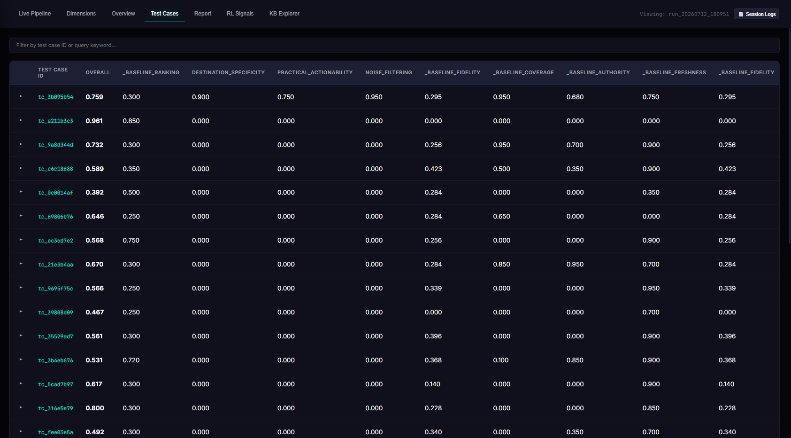

#### Tier 1 — P1 Agent (Document Intelligence Profiler)

One P1 agent call per scraped URL. Runs **concurrently** for all URLs. Uses `P1_MODEL` at `temperature=0.0` with JSON mode.

**Domain pre-classification (deterministic, before LLM call):**
URLs are classified into `authoritative` (.gov, .mil, .un.org, .who.int, etc.), `academic` (.edu, .ac.uk, etc.), `organization` (.org), or `commercial` based on TLD matching.

**P1 extracts per URL:**

| Field | Description |
|-------|-------------|
| `scrape_score` / `scrape_level` | Scrape fidelity score (0–1) and L1–L5 level |
| `scrape_issues` | Specific identified issues (e.g., "tables flattened", "nav noise dominant") |
| `nav_link_ratio` | Fraction of content that is navigation links (0–1) |
| `boilerplate_pattern_count` | Count of detected boilerplate blocks |
| `table_count`, `heading_count`, `list_count`, `code_block_count` | Structural element counts |
| `primary_topic` | One precise sentence describing what the page is about |
| `page_type` | Document type (official_documentation, news_article, blog_post, academic_paper, etc.) |
| `publication_date` | Extracted publish date (YYYY-MM-DD or partial) |
| `detected_language` | ISO 639-1 code, or "mixed" |
| `query_relevance_score` | Float 0–1: how relevant this document is to the query |
| `authority_score` / `authority_assessment` | Numerical credibility score + narrative |
| `author_credentials` | Any professional credentials visible in the document |
| `key_claims` | ≥5 atomic factual statements (subject + predicate + specific object) |
| `data_points` | Exact numbers, measurements, thresholds as they appear |
| `named_entities` | People, organizations, products/chemicals, locations, laws/standards |
| `temporal_markers` | All explicit date references from the full body |
| `section_summaries` | Per-heading key point summaries |
| `table_contents` | Description + key data for each table |
| `content_completeness` | complete / appears_truncated / partial / navigation_only / error_page |
| `content_gaps` | What the query requires that this document doesn't address |
| `query_coverage_assessment` | answers_query (bool), coverage_level, missing_aspects |

**Post-processing guardrails (`_validate_p1_consistency`):**
- `navigation_only` or `error_page` → key_claims cleared, scrape_score clamped ≤ 0.20, query_relevance = 0.0
- word_count < 150 → key_claims limited to 2, section_summaries to 1
- authority_score > 0.7 with no narrative → authority_score downgraded to 0.5
- scrape_level = L5 with `appears_truncated` → downgraded to L4
- Non-English content → query_relevance_score = 0.0

#### Tier 2 — P2 Agents (Rubric Dimension Scorers)

Five dimension families. Each active family runs as a separate concurrent LLM call. Uses `P2_MODEL` at `temperature=0.0` with JSON mode.

**Routing:** Each rubric dimension is routed to a family by keyword matching on `dimension.name + dimension.criteria`:

| Family | Keywords |
|--------|----------|
| `ranking` | ranking, ordering, priority, position, result order, rank |
| `authority` | authority, credibility, trustworthy, source quality, expert, official, credentials |
| `freshness` | temporal, freshness, recency, current, recent, date, latest, updated, real-time |
| `precision` | accuracy, numerical, factual, precision, statistics, data, measurement, consistent |
| `coverage` | everything else (default catch-all) |

**P2 input:** All P1 profiles as JSON + the specific dimensions to evaluate + rubric grading notes + query context.

**5-Step Chain of Thought per dimension:**

| Step | Field | What It Captures |
|------|-------|-----------------|
| 1 | `evidence_found` | Specific quotes from P1 profiles supporting the judgment |
| 2 | `criteria_checklist` | Per-condition MET / PARTIALLY_MET / NOT_MET with evidence |
| 3 | `contrastive_fail_triggered` | Does the explicit failure pattern from the rubric match? |
| 4 | `assigned_level` + `level_justification` | Which L1–L5 band, and why not the adjacent band |
| 5 | `score` + `summary_reasoning` | Precise float within level range + one-sentence summary |

**Score clamping:** `_clamp_score_to_level()` enforces that the numeric score falls within the declared level band. Mismatches are logged as warnings.

#### Fidelity Dimension (Deterministic)

Fidelity is not routed to any P2 LLM. It is computed directly from P1 scrape scores:

```
fidelity_score = 0.70 × mean(p1.scrape_score) + 0.30 × min(p1.scrape_score)
```

This makes fidelity evaluation free of LLM variance — it is derived purely from the structured extraction already done in P1.

#### Baseline Dimension Enforcement

After routing, `enforce_baseline_dimensions()` checks that every evaluation includes at minimum: **fidelity, ranking, coverage, authority, freshness**. Any missing baselines are added at their fixed weights, with the existing rubric dimensions scaled down proportionally to maintain weight sum = 1.0.

#### Sanity Checks

After all evaluations are assembled, `sanity_check()` flags:
- All dimensions scoring identically (likely LLM laziness)
- Score compression — all scores in the 0.5–0.7 band (full L1–L5 scale unused)
- Contradiction: `contrastive_fail_triggered = true` but `score > 0.40`
- Level/score mismatch after clamping

Warnings are stored in `EvalResult.warnings` and surfaced in the dashboard.

#### Judge Cache

The judge caches results by a SHA-256 key computed from `query + rubric dimensions + sorted content hashes`. Cache hits skip all LLM calls and return immediately.

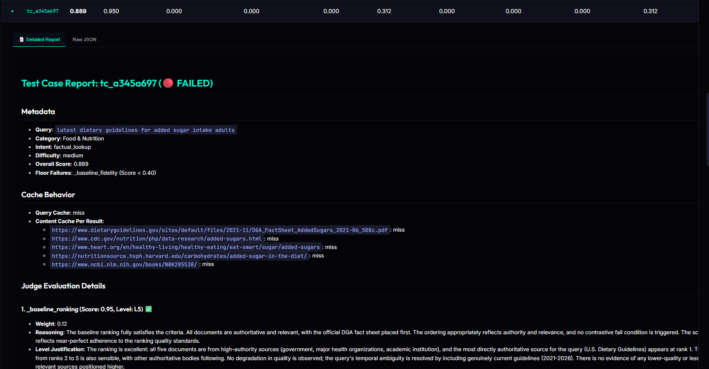

---

### Agent 3 — Improvement Agent (`eval/improvement_agent.py`)

The Improvement Agent operates at two levels:

#### Level 1 — Per-TC Diagnosis (inline, background task)

Runs immediately after each TC's judge evaluation as a background task. Uses `IMPROVEMENT_AGENT_MODEL`.

**Output — `TestCaseDiagnosis`:**

| Field | Description |
|-------|-------------|
| `root_cause_summary` | One-paragraph diagnosis of why this TC scored as it did |
| `coverage_diagnosis` / `ranking_diagnosis` / `scrape_diagnosis` | Dimension-specific diagnosis text |
| `improvement_actions` | List of concrete suggested actions |
| `weak_dimensions` | Dimension names that scored below median |
| `floor_failures` | Dimension names that triggered the dimension floor |
| `micro_pattern` | `{pattern_type, affected_dimension, severity, description, suggested_fix}` — fed into RL signals |
| `dpo_rationale` | Explicit preference rationale for the DPO training pair |
| `url_quality_annotations` | Per-URL `{url, quality_score, quality_note}` — drives reward signals and listwise rankings |
| `query_reformulation` | `{reformulated_query, expected_delta, rationale}` — becomes a `QueryReformulationPair` |
| `criteria_summary` | Forwarded criteria checklist from the judge |

#### Level 2 — Cross-Run Synthesis (post-run)

After all TCs complete, the Improvement Agent performs a cross-run analysis with structured inputs:

- Score distributions as histograms across all dimensions
- `per_tc_diagnoses_summary` with all micro-patterns and reformulations
- `ranking_disagreements`: all dimensions that scored < 0.7 with contrastive_fail triggered
- `worst_10_tcs`: full breakdown including worst scrape URL and structural issues
- `category_breakdown`, `intent_breakdown`, `difficulty_breakdown`: aggregated performance slices
- `scrape_evidence`: raw content metadata per TC

**Output — `ImprovementAnalysis`:**

| Field | Description |
|-------|-------------|
| `root_causes` | Top 5 root causes with dimension, evidence (cited tc_ids), severity, frequency, confidence |
| `proposals` | Engineering proposals per root cause with expected_impact and priority_score |
| `quick_wins` | Low-effort/high-impact fixes |
| `cross_dimension_patterns` | Failure patterns observable across multiple dimension types |
| `judge_bias_flags` | Dimensions that consistently score high while per-TC diagnoses show failures |
| `enhanced_patterns` | Enriched RL taxonomy patterns |

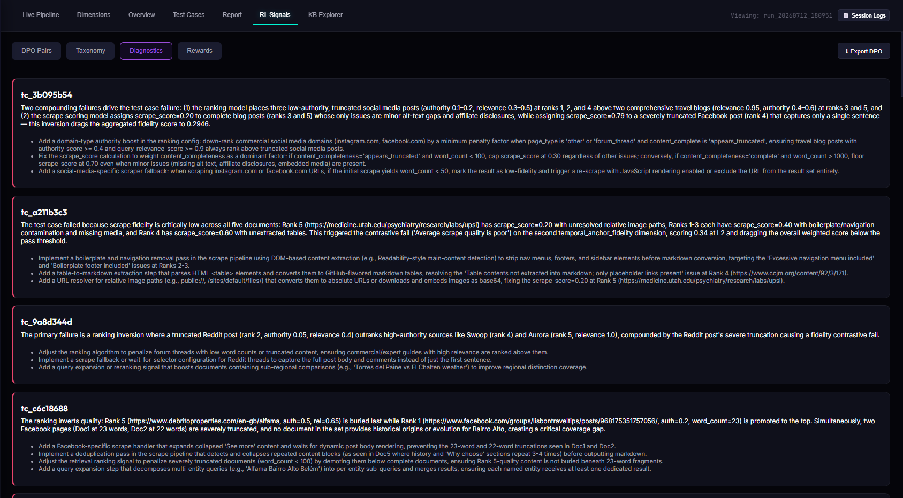

---

### Scoring System

#### L1–L5 Scoring Levels

All scoring operates on a 5-level ordinal scale with numeric bands:

| Level | Range | Interpretation |
|-------|-------|----------------|
| L1 | 0.00 – 0.20 | Critical failure — fundamental problems |
| L2 | 0.20 – 0.40 | Major deficiency — significant gaps |
| L3 | 0.40 – 0.60 | Partial / adequate — covers the basics |
| L4 | 0.60 – 0.80 | Good — meets most criteria |
| L5 | 0.80 – 1.00 | Excellent — strong across all criteria |

#### Overall Score Calculation

```
overall_score = Σ (dimension.weight × dimension.score)
```

Weights are defined per-TC in the rubric and always sum to 1.0 (after baseline dimension injection).

#### Hybrid Pass Gate

```python
def passes(overall_threshold=0.65, dimension_floor=0.40) -> bool:
    if overall_score < overall_threshold:
        return False
    for dim in dimension_evals:
        if not dim.is_fallback and dim.score < dimension_floor:
            return False
    return True
```

A test case can fail to pass even with a high overall score if a single dimension has a critical failure.


---

### RL Signal Generation

7 structured training signal files are produced per run, all in `outputs/runs/{run_id}/rl_signals/`:

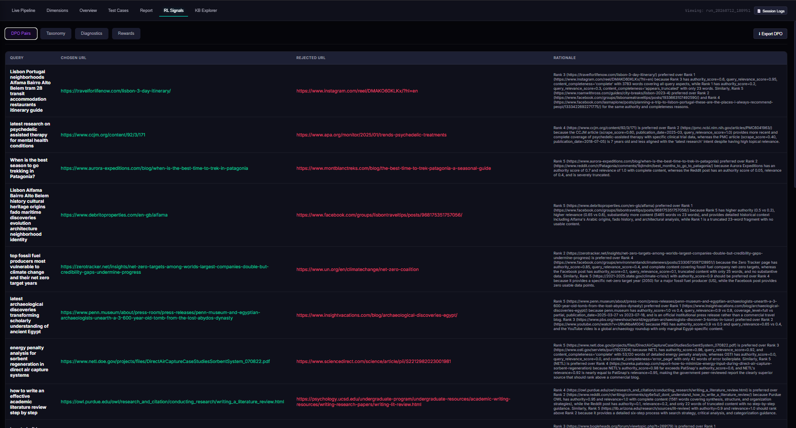

| File | Signal Type | Description |
|------|-------------|-------------|
| `dpo_pairs.jsonl` | **DPO Pairs** | Preference learning — chosen URL (highest LLM quality annotation) vs. rejected URL (Firecrawl's top-ranked) when they differ |
| `rewards.jsonl` | **Reward Signals** | Scalar composite reward per URL: `0.30×relevance + 0.25×llm_quality + 0.20×completeness + 0.15×freshness + 0.10×authority` |
| `listwise_rankings.jsonl` | **Listwise Rankings** | Full ideal URL ordering with quality scores and notes, vs. Firecrawl's actual ordering |
| `contrastive_fail_pairs.jsonl` | **Contrastive Fail Pairs** | Good-state vs. bad-state document pairs when a rubric dimension's explicit failure pattern is triggered |
| `query_reformulations.jsonl` | **Query Reformulations** | Original failing query + LLM-suggested better formulation, tagged by chaos archetype and failing dimensions |
| `sft_gold.jsonl` | **SFT Gold Examples** | High-scoring TCs (≥ `sft_gold_score_threshold`, no floor failures) with gold URLs, key claims, and full rubric |
| `scrape_quality_labels.jsonl` | **Scrape Quality Labels** | Per-URL quality label (excellent/good/poor/unusable) with structural features: word count, nav ratio, table count, boilerplate, truncation |
| `taxonomy.json` | **Pattern Taxonomy** | Aggregated micro-patterns grouped by type, sorted by frequency across all TCs |

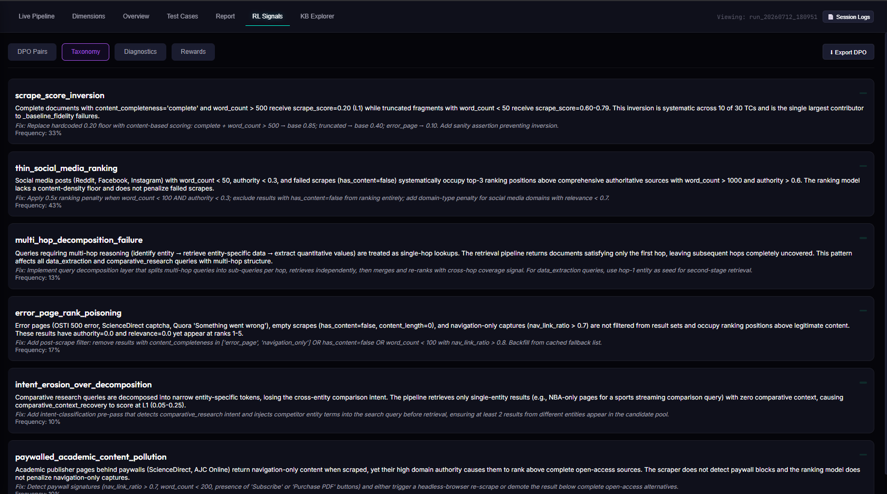

---

### Knowledge Base — Qdrant + BGE-M3

#### Embedding Model

**BAAI/bge-m3** runs locally via `FlagEmbedding`. Produces:
- **Dense vector** (1024 dimensions) for semantic similarity
- **Sparse vector** (BM25-style lexical weights) for keyword matching

Both are combined with **Reciprocal Rank Fusion (RRF)** at query time. The embedder is protected by a semaphore (`asyncio.Semaphore(1)`) to prevent concurrent PyTorch model calls.

#### Qdrant Collections

| Collection | Purpose |
|------------|---------|
| `firecrawl_eval` (configurable) | Content KB — chunked, deduplicated scraped documents |
| `firecrawl_query_cache` | Query result cache — dense-only, stores search result lists by query embedding |

#### Content Chunking

The indexer uses an adaptive markdown chunker:
- Target chunk size scales with document length: `min(5000, 1500 + (doc_len // 10000) × 500)` characters
- 15% overlap between chunks
- Heading boundaries flush chunks early (at ≥ 40% of target size)
- Each chunk stores: `url`, `query_origin`, `content_hash`, `doc_content_hash`, `chunk_index`, `total_chunks`, `scrape_timestamp`

#### Content Deduplication

`index_batch_deduped()` bulk-checks all chunk SHA-256 hashes against existing Qdrant points before embedding. Only genuinely new chunks are embedded and upserted.

#### KB Reconstruction

When a URL qualifies for an L2 cache hit, the retriever scrolls **all** chunks for that URL (up to 10,000), sorts them by `chunk_index`, and concatenates them back into the full document. This ensures the P1 agent always receives complete document content even from cached sources.

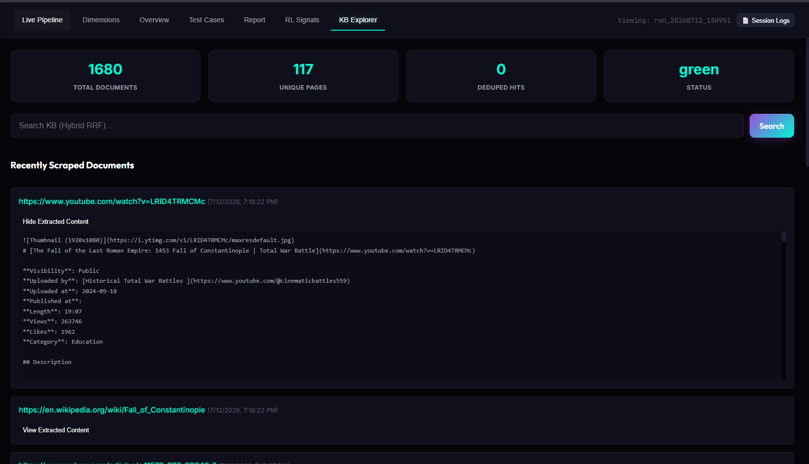

---

### Regression Detection

`reports/regression.py` — `RegressionDetector` compares each run's dimension scores against historical run averages. Regressions (dimension drops ≥ a threshold) are surfaced in the run report's regression section.

---

### Ranking Comparator

`eval/comparator.py` — `RankingComparator` compares the order of URLs returned by Firecrawl against the LLM-ideal ordering derived from P1 quality annotations. Results are included in the run report's retrieval comparison section and fed into the Improvement Agent's cross-run input.

---

### Dimensions Tab

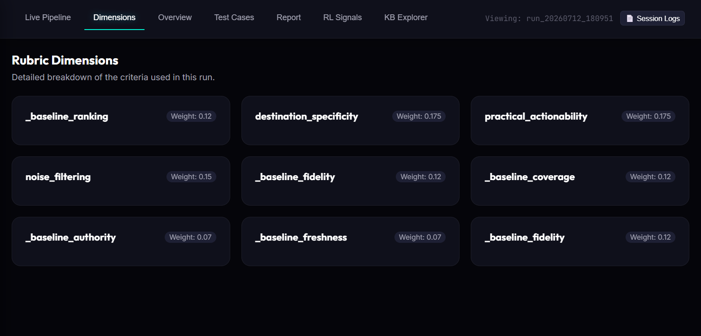

The Dimensions tab renders the specific rubric dimensions used in the loaded run as cards — showing each dimension's name, weight percentage, criteria text, and contrastive fail description. Because rubrics are per-TC and dynamically generated, the dimensions shown are discovered from the run's eval results.

---

## Data Models

### `TestCase`

```python
@dataclass
class TestCase:
    id: str                      # e.g., "tc_3b095b54"
    query: str                   # The adversarial search query
    domain: str                  # One of 16 knowledge domains
    intent: str                  # One of 7 valid intents
    difficulty: str              # "easy" | "medium" | "hard"
    chaos_archetype: str         # One of 7 archetypes
    cache_relationship: str      # "novel" | "same_source_different_angle" | ...
    category: str                # Same as domain (UI compatibility)
    parent_case_id: Optional[str] # Set for cache variants
    rubric: Optional[EvalRubric]  # 2–4 custom dimensions
    cache_intent: str            # Mirrors cache_relationship
```

### `EvalRubric` / `RubricDimension`

```python
@dataclass
class RubricDimension:
    name: str          # e.g., "source_authority"
    weight: float      # Contribution to overall score (all weights sum to 1.0)
    criteria: str      # What a successful result looks like
    contrastive_fail: str  # Explicit failure pattern description

@dataclass
class EvalRubric:
    dimensions: List[RubricDimension]
    grading_notes: str  # Meta-guidance for edge case handling
```

### `P1Result`

Structured document profile produced by the P1 agent — see [Agent 2 section](#tier-1--p1-agent-document-intelligence-profiler) for the full field list.

### `DimensionEval`

```python
@dataclass
class DimensionEval:
    dimension_name: str
    weight: float
    evidence_found: List[str]           # Step 1: quotes from profiles
    criteria_checklist: List[CriteriaCheck]  # Step 2: per-condition status
    contrastive_fail_triggered: bool    # Step 3
    contrastive_fail_explanation: str   # Step 3
    assigned_level: str                 # Step 4: "L1"–"L5"
    level_justification: str            # Step 4
    score: float                        # Step 5: clamped to level band
    reasoning: str                      # Summary sentence
    is_fallback: bool                   # True if LLM call failed
```

### `EvalResult`

```python
@dataclass
class EvalResult:
    test_case_id: str
    dimension_evals: List[DimensionEval]
    overall_score: float
    document_profiles: Optional[List[Dict]]  # Serialized P1Results
    warnings: List[str]                      # Sanity check flags
    result_diversity: Optional[Dict]

    # Backward-compat convenience properties
    coverage_score: float   # Best-match from dimension_evals
    ranking_score: float
    fidelity_score: float
    floor_failures: List[str]  # Dimensions below 0.40
```

### RL Signal Dataclasses

| Class | Fields |
|-------|--------|
| `DPOPair` | query, test_case_id, chosen (DPOVariant), rejected (DPOVariant), preference_rationale |
| `RewardSignal` | query, url, reward_components (relevance, completeness, freshness, markdown_quality, authority), composite_reward, trajectory (search_rank, ideal_rank, rank_delta) |
| `ListwiseRankingExample` | query, ideal_ranking (List[str]), url_quality_scores, firecrawl_ranking, confidence |
| `ContrastiveFailPair` | query, dimension, bad_state (dict), good_state (dict), failure_explanation, judge_score, failure_level |
| `QueryReformulationPair` | original_query, reformulated_query, chaos_archetype, failing_dimensions, expected_coverage_delta |
| `SFTGoldExample` | query, overall_score, gold_urls, key_claims_covered, dimension_scores, rubric_dimensions |
| `ScrapeQualityLabel` | url, quality_label (excellent/good/poor/unusable), fidelity_score, issues, noise_ratio, word_count, has_tables, tables_preserved, content_completeness |

---

## Output Structure

```
outputs/
├── data/
│   └── test_case_history.jsonl    # Accumulated TC history (used for dedup + cache variants)
│
└── runs/
    └── run_YYYYMMDD_HHMMSS/
        ├── run.json               # Full run: test_cases, eval_results, tc_diagnoses,
        │                          #   improvement_analysis, regression, run_meta
        ├── run_meta.json          # Lightweight status + overall_score + timing
        ├── session.log            # Full log of this run's execution
        ├── report.md              # Full markdown evaluation report
        ├── tc_reports/
        │   └── tc_XXXXXXXX.md    # Per-TC markdown report
        └── rl_signals/
            ├── dpo_pairs.jsonl
            ├── rewards.jsonl
            ├── listwise_rankings.jsonl
            ├── contrastive_fail_pairs.jsonl
            ├── query_reformulations.jsonl
            ├── sft_gold.jsonl
            ├── scrape_quality_labels.jsonl
            └── taxonomy.json
```

---

## Running the Pipeline

### Prerequisites

```bash
pip install -r requirements.txt
```

Requires: Python 3.10+, a running Qdrant instance (cloud or local), Firecrawl API keys, and OpenRouter API keys.

**Local Qdrant (Docker):**
```bash
docker run -p 6333:6333 qdrant/qdrant
```

### Environment Setup

Create a `.env` file in the project root:

```env
FIRECRAWL_API_KEY_1=fc-...
OPENROUTER_KEY_1=sk-or-...
OPENROUTER_KEY_2=sk-or-...

QDRANT_URL=http://localhost:6333
QDRANT_API_KEY=

GENERATOR_MODEL=minimax/minimax-m3
P1_MODEL=deepseek/deepseek-v4-flash
P2_MODEL=deepseek/deepseek-v4-flash
IMPROVEMENT_AGENT_MODEL=z-ai/glm-5.2

NUM_TEST_CASES=30
PASS_THRESHOLD=0.65
```

### Launch

```bash
# Web dashboard (recommended)
python run.py

# CLI — full run
python run.py --cli

# Quick smoke test (5 cases)
python run.py --cli --cases 5
```

---

## Dashboard Walkthrough

### Live Pipeline Tab

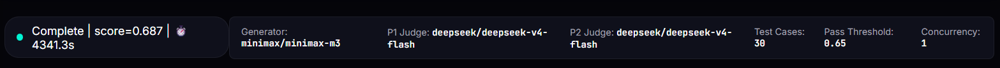

Before streaming begins, the run configuration panel shows the active model selections, pass threshold, dimension floor, and number of test cases for the current run.


The left panel shows a real-time SSE event timeline: TC generation, search results, scrape completions, P1/P2 scoring, and diagnosis events stream in chronologically. The right panel shows the live leaderboard — TC IDs and their overall scores as they complete, updated in real time.

### Overview Tab


Gauge rings for each rubric dimension in the run. The stats row below shows aggregate pass rate, the best and worst scoring queries, and total run duration.

### Test Cases Tab


The main table shows all TCs with overall score and one column per rubric dimension. Click any row to expand its full detail panel.


The expanded panel shows the TC's query, rubric, per-dimension scores with level and reasoning, and the full P1 document profiles for each URL.

### Report Tab

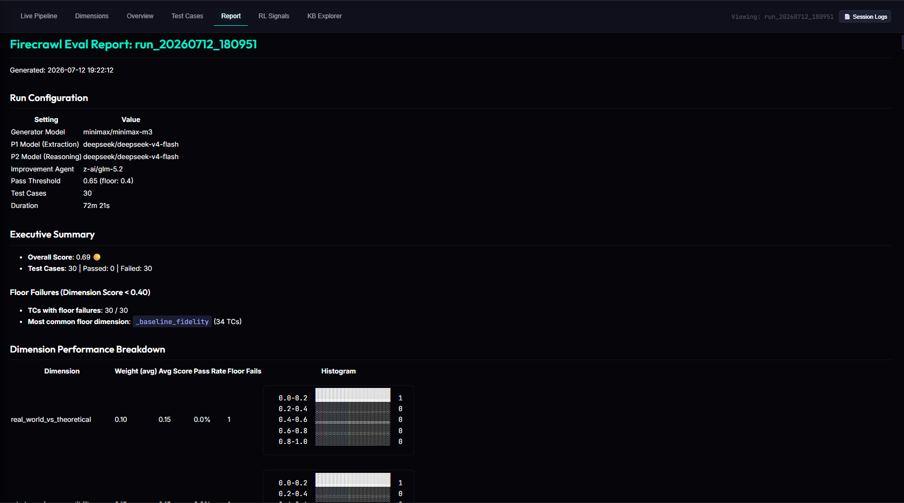

The rendered markdown run report. Includes: run configuration, executive summary, floor failures, dimension breakdown, per-TC results, cache analytics, improvement proposals, and regression data. A download button exports the raw markdown.

### RL Signals Tab


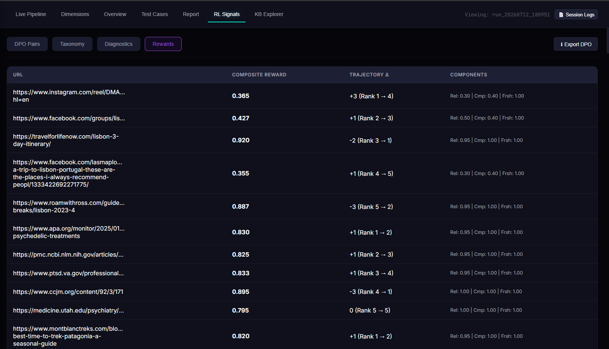


Four sub-tabs expose the RL signal data: DPO chosen/rejected pairs, the pattern taxonomy clusters, per-URL reward signal breakdowns, and the full TC diagnostic cards from the Improvement Agent.

### KB Explorer Tab


Stats grid showing total document chunks, unique pages indexed, and deduplication count. The hybrid RRF search box lets you query the KB directly with the same retrieval pipeline the evaluation uses.

---

## Extending the System

### Adding a New Chaos Archetype

1. Add the new archetype name to `AGENT_CHAOS_ARCHETYPES` in `models/test_case.py`
2. Add it with a weight to `archetype_weights` in `config.py`
3. Update the system prompt in `TestGenerator._fetch_single()` to describe what it means and what failure it simulates

### Adding a New Knowledge Domain

Add the domain string to the domain list in `TestGenerator._fetch_single()`'s system prompt.

### Adding a Custom Rubric Dimension Family

Add the routing keywords to the `_route_dimensions()` method in `eval/judge.py`, and add a corresponding `_run_p2_<family>()` method and entry in the `p2_coros` dict inside `evaluate()`.

### Adjusting Archetype Weights at Runtime

```env
ARCHETYPE_WEIGHTS=none:0.20,temporal_ambiguity:0.25,multi_hop_compressed:0.20,keyword_stuffed:0.15,reformulation_drift:0.10,over_decomposed:0.05,copy_paste_artifact:0.05
```

---

## Known Issues & Planned Improvements

This section documents known architectural gaps identified in the current implementation. These are candidates for the next development cycle.

---

### 🔴 P1 Agent Context Rot (Full Document Dumping)

**What it is:** The P1 agent receives the *entire scraped markdown* of each URL as a single user prompt — including all boilerplate, navigation, footers, and off-topic content. For large pages (common in documentation, government sites, or news aggregators), this can exceed 50,000+ tokens per URL.

**Why it's a problem:** Very long contexts cause LLMs to lose attention on information near the middle of the document ("lost in the middle" effect). The P1 agent may miss key claims buried in the middle of a large article even though the content is present. Additionally, large prompts are expensive and slow.

**Planned fix:** Pre-truncate documents to the most query-relevant chunks using the KB hybrid RRF scores already computed before the P1 call. Send only the top-K chunks ranked by relevance to the P1 agent, with explicit chunk boundaries marked.

---


### 🔴 Dimension Routing is Keyword-Only with No Fallback Disambiguation

**What it is:** `_route_dimensions()` assigns each rubric dimension to a P2 agent family by scanning the dimension's `name + criteria` text for keyword matches. If multiple keywords match (e.g., a dimension about "current data accuracy" could match both `freshness` and `precision`), the first matching branch wins due to `elif` chaining.

**Why it's a problem:** Dimensions with overlapping criteria are silently misrouted. A `freshness` judge evaluating a `precision` dimension will apply the wrong evaluation philosophy even though the rubric criteria are identical. The routing is invisible to the operator.

**Planned fix:** Add explicit `dimension_family` field to `RubricDimension` that the test generator sets at generation time. The router falls back to keyword matching only when this field is absent.

---

### 🟡 Improvement Agent Level-2 Context Window Risk

**What it is:** The `_build_agent_input()` method in `ImprovementAgent` serializes the worst 10 TCs with full scrape evidence, all ranking disagreements, all per-TC diagnoses, and score histograms into a single JSON payload passed as the LLM prompt.

**Why it's a problem:** For runs with 30+ test cases, this payload can approach the context limit of some models. The `glm-5.2` model (default for the Improvement Agent) has been observed returning truncated responses, which the code handles gracefully but silently degrades the quality of root cause analysis.

**Planned fix:** Implement a two-pass summarization — run a lightweight pass to score and rank the most impactful items, then send only the top-N items in the full analysis prompt.

---

### 🟡 Query Cache Uses Dense-Only Similarity

**What it is:** The L1 query cache lookup (`find_similar_query()`) was designed to use hybrid RRF (dense + sparse BM25) for similarity scoring — matching how the KB content search works. Currently only the dense BGE-M3 vector is used; the sparse component is computed by the embedder but not passed through to the cache lookup.

**Why it's a problem:** Dense-only similarity can conflate queries that share semantic context but ask for different information (e.g., "current FDA drug approval process" vs. "current FDA drug approval statistics"). Both share high cosine similarity but the cached results may be entirely wrong for the second query. The sparse component would catch the keyword-level difference between "process" and "statistics" that the dense vector smooths over.

**Planned fix:** Wire the sparse vector output from `EmbedderClient` into `find_similar_query()` to enable the intended hybrid RRF scoring. Raise the hit threshold correspondingly once hybrid scoring is active.

---

### 🟡 TC History Has No Archetype-Aware Stratification

**What it is:** When sampling parent TCs for cache variant generation (`history.sample(n)`), the sampling is stratified only by recency (last 5 vs. older). It does not consider archetype distribution.

**Why it's a problem:** If one archetype dominates recent history (e.g., 4 of the last 5 TCs are `temporal_ambiguity`), cache variants will inherit the same archetype, skewing the variant distribution away from the intended archetype weights.

**Planned fix:** Stratify the parent sample by archetype to ensure variants proportionally represent the full archetype distribution.

---


### 🟢 Contrastive Fail Pairs Require URL Quality Annotations

**What it is:** `ContrastiveFailPair` generation requires `url_quality_annotations` from the Improvement Agent's per-TC diagnosis. If the diagnosis LLM call fails or returns no annotations, no contrastive fail pairs are generated for that TC even if `contrastive_fail_triggered` was set by the P2 judge.

**Why it's a problem:** The most interesting training pairs — those where a rubric failure pattern was triggered — may be silently dropped when the diagnosis agent is unavailable or over capacity.

**Planned fix:** Make the `good_state` URL selection fall back to the highest P1 `query_relevance_score` URL when annotations are missing, rather than skipping pair generation entirely.

---


