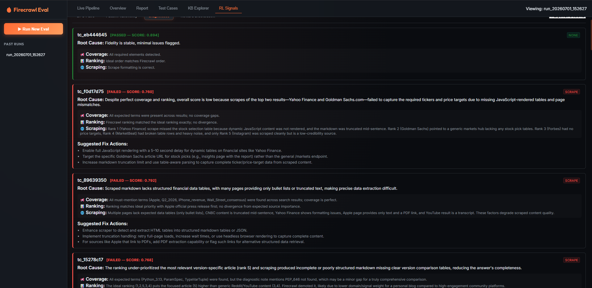
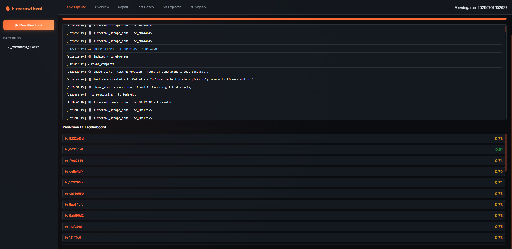
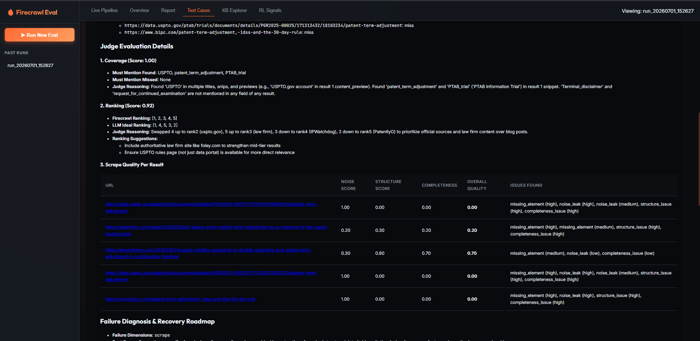
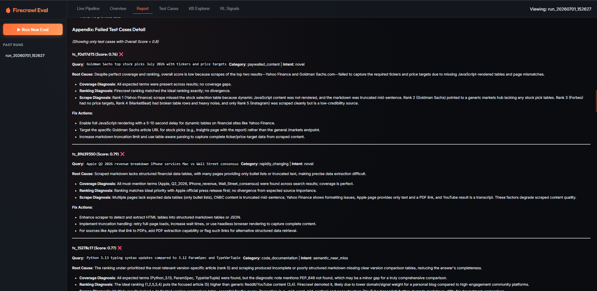
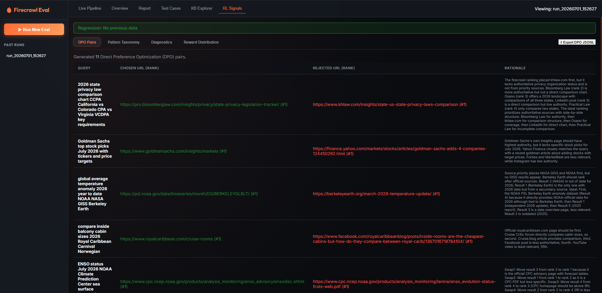
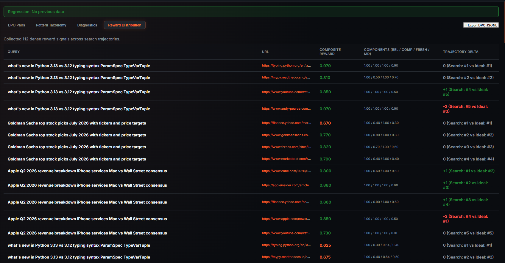

# Firecrawl Eval Showcase

[](./LICENSE)

> A fully automated, LLM-powered evaluation pipeline for benchmarking Firecrawl's search & scrape quality. It generates adversarial test cases, executes them through a live Firecrawl + Knowledge Base pipeline, judges results across three dimensions, emits RL training signals, and produces a rich per-run report — all with a real-time web dashboard.

---



---

## Table of Contents

1. [System Overview](#system-overview)
2. [Architecture Diagram](#architecture-diagram)
3. [Core Design Principles](#core-design-principles)
4. [Module Reference](#module-reference)
   - [Entry Point: `run.py`](#entry-point-runpy)
   - [Configuration: `config.py`](#configuration-configpy)
   - [Web Dashboard: `app.py`](#web-dashboard-apppy)
   - [Agent 1 — Test Generator: `eval/test_generator.py`](#agent-1--test-generator-evaltest_generatorpy)
   - [Agent 2 — LLM Judge: `eval/judge.py`](#agent-2--llm-judge-evaljudgepy)
   - [Agent 3 — Improvement Agent: `eval/improvement_agent.py`](#agent-3--improvement-agent-evalimprovement_agentpy)
   - [Calibration: `eval/calibration.py`](#calibration-evalcalibrationpy)
   - [Pipeline Orchestrator: `pipeline/orchestrator.py`](#pipeline-orchestrator-pipelineorchestratorpy)
   - [Firecrawl Client Pool: `clients/firecrawl_client.py`](#firecrawl-client-pool-clientsfirecrawl_clientpy)
   - [OpenRouter Client Pool: `clients/openrouter.py`](#openrouter-client-pool-clientsopenrouterpy)
   - [Embedder: `clients/embedder.py`](#embedder-clientsembedderpy)
   - [Qdrant Store: `search_ir/qdrant_store.py`](#qdrant-store-search_irqdrant_storepy)
   - [Indexer: `search_ir/indexer.py`](#indexer-search_irindexerpy)
   - [Retriever: `search_ir/retriever.py`](#retriever-search_irretrieverpy)
   - [RL Signal Generator: `rl/signal_generator.py`](#rl-signal-generator-rlsignal_generatorpy)
   - [Report Builder: `reports/report_builder.py`](#report-builder-reportsreport_builderpy)
5. [Data Models](#data-models)
6. [The Two-Layer Cache System](#the-two-layer-cache-system)
7. [Scoring System](#scoring-system)
8. [RL Signal Generation](#rl-signal-generation)
9. [Pipeline Execution Flow (Step-by-Step)](#pipeline-execution-flow-step-by-step)
10. [Output Directory Structure](#output-directory-structure)
11. [Setup & Installation](#setup--installation)
12. [Configuration Reference (`.env`)](#configuration-reference-env)
13. [Running the Pipeline](#running-the-pipeline)
14. [Web Dashboard API](#web-dashboard-api)
15. [Extending the System](#extending-the-system)
16. [License](#license)

---

## System Overview

This project is an **end-to-end evaluation harness** for the [Firecrawl](https://firecrawl.dev) search and scrape API. It answers the question:

> *"How well does Firecrawl actually find, rank, and extract content for a diverse set of realistic web queries?"*

The pipeline operates in a continuous **round-based loop**:

```
[Round N]
  ├── Generate N adversarial test cases (LLM-A / TestGenerator)
  ├── For each test case:
  │     ├── Layer 1 Cache: check if query was seen before (vector similarity)
  │     ├── Firecrawl Search → top-5 results
  │     ├── Layer 2 Cache: for each URL, hybrid-search KB for existing content
  │     ├── Scrape missing URLs via Firecrawl API
  │     ├── Background-index new content into Qdrant (BGE-M3 dense + sparse)
  │     ├── Judge (LLM-B): evaluate Coverage, Ranking, Scrape Quality concurrently
  │     └── Improvement Agent (LLM-C): per-TC root-cause diagnosis
  └── After all rounds:
        ├── Full Retrieval Comparison (Firecrawl rank vs KB rank vs Ideal rank)
        ├── RL Signal Generation (DPO pairs + reward signals)
        ├── Improvement Agent: cross-run synthesis & roadmap
        └── Report Builder: markdown report + per-TC reports
```

---

## Architecture Diagram

```
┌─────────────────────────────────────────────────────────────────────────┐
│                        run.py / app.py (Entry Points)                   │
│             CLI mode ──────────────────── Web Dashboard (FastAPI + SSE) │
└───────────────────────────────┬─────────────────────────────────────────┘
                                │
                       ┌────────▼────────┐
                       │   Orchestrator  │  pipeline/orchestrator.py
                       │  (Round Loop)   │
                       └─────┬──────┬───┘
                             │      │
              ┌──────────────▼──┐  ┌▼──────────────────┐
              │  TestGenerator  │  │  FirecrawlClientPool│
              │   (LLM-A)       │  │  search() + scrape()│
              │  test_generator │  │  firecrawl_client   │
              └──────────────┬──┘  └─────────┬───────────┘
                             │               │
                    ┌────────▼───────────────▼──────────────┐
                    │           Two-Layer Cache              │
                    │  L1: Query Vector Cache (Qdrant)       │
                    │  L2: KB Hybrid Content Cache (Qdrant)  │
                    └────────────────────┬──────────────────┘
                                         │
                    ┌────────────────────▼──────────────────┐
                    │           BGE-M3 Embedder              │
                    │  Dense (1024-dim) + Sparse (BM25-lex)  │
                    │  clients/embedder.py                   │
                    └────────────────────┬──────────────────┘
                                         │
                    ┌────────────────────▼──────────────────┐
                    │         Qdrant (AsyncQdrantClient)     │
                    │  Collections:                          │
                    │   · firecrawl_eval  (content KB)       │
                    │   · firecrawl_query_cache              │
                    │  search_ir/qdrant_store.py             │
                    │  search_ir/indexer.py                  │
                    │  search_ir/retriever.py                │
                    └────────────────────────────────────────┘
                                         │
              ┌──────────────────────────▼─────────────────────────────┐
              │                   Judge (LLM-B)                        │
              │  3 concurrent passes: Coverage · Ranking · Scrape      │
              │  eval/judge.py                                         │
              └──────────────────────────┬─────────────────────────────┘
                                         │
              ┌──────────────────────────▼─────────────────────────────┐
              │            Improvement Agent (LLM-C)                   │
              │  Per-TC diagnosis (live) → Cross-run synthesis         │
              │  eval/improvement_agent.py                             │
              └──────────────────────────┬─────────────────────────────┘
                                         │
     ┌───────────────────────────────────▼────────────────────────────────┐
     │                        RL Signal Generator                         │
     │  DPO pairs · Reward signals · Failure taxonomy                     │
     │  rl/signal_generator.py                                            │
     └───────────────────────────────────┬────────────────────────────────┘
                                         │
     ┌───────────────────────────────────▼────────────────────────────────┐
     │                         Report Builder                             │
     │  Executive summary · Retrieval comparison · Roadmap               │
     │  Per-TC markdown reports                                           │
     │  reports/report_builder.py                                         │
     └────────────────────────────────────────────────────────────────────┘
```

---

## Core Design Principles

### 1. Rolling Generation (Knowledge Feedback Loop)
Each round of test case generation receives the full history of:
- All previous query strings → so the LLM avoids semantic near-duplicates
- All URLs currently in the Qdrant KB → so novel queries target uncrawled territory

This means as the KB fills up, later test cases are *harder* — they probe domains not yet indexed, exposing fresh weaknesses rather than re-testing what already works.

### 2. Two-Phase Test Case Strategy
Every batch is either an **anchor round** (65%) or a **variant round** (35%):

| Phase | What it does | Why |
|-------|-------------|-----|
| **Anchor** (novel) | Domain-bucket-sampled, adversarial queries from 13 distinct knowledge domains | Ensures broad coverage and domain diversity |
| **Variant** (cache) | Semantic paraphrases, exact duplicates, or related queries derived from history | Probes the two-layer cache, ensuring cache hits don't silently corrupt results |

### 3. Concurrent, Non-Blocking Architecture
The orchestrator uses `asyncio.gather()` extensively:
- Firecrawl scrape calls for all top-N URLs fire **in parallel** per test case
- The judge's three evaluation passes (Coverage, Ranking, Scrape) run **concurrently**
- Qdrant indexing is fired as a **background task** immediately after scraping, so the LLM judge call and indexing overlap
- Multiple test cases within a batch run **concurrently**, gated by a `Semaphore` to prevent API overload

### 4. Separation of LLM Roles
Three distinct LLM models serve three distinct roles, configurable independently:

| Role | Model (default) | Temperature | Purpose |
|------|----------------|-------------|---------|
| **Generator (LLM-A)** | `deepseek/deepseek-v4-pro` | 0.8 | Creative adversarial query generation |
| **Judge (LLM-B)** | `deepseek/deepseek-v4-flash` | 0.1 | Deterministic scoring (Coverage, Ranking, Scrape) |
| **Improvement Agent (LLM-C)** | `deepseek/deepseek-v4-pro` | 0.1–0.2 | Root-cause analysis and engineering proposals |

---

## Module Reference

### Entry Point: `run.py`

The single entry point for all pipeline modes.

```
python run.py                     # Launches FastAPI web dashboard on :8000
python run.py --cli               # Full pipeline run in terminal (no web server)
python run.py --cli --cases 5     # Quick 5 TC smoke test
python run.py --calibrate-only    # Run judge calibration pre-flight only
```

**How it works in `--cli` mode:**
1. Loads `EvalConfig` from `.env`
2. Creates an `asyncio.Queue` and wires it to `sse_queue_var` (a `ContextVar`) so the orchestrator can emit SSE-style events that the CLI drains to `stdout`
3. Calls `Orchestrator.run_pipeline()` inside `asyncio.run()`

The `drain_events()` coroutine inside `run.py` maps internal event types to human-readable log prefixes like `[1/7] Calibration`, `[TC] tc_id "query..."`, `[Judge] cov=0.92 rnk=0.88`.

---

### Configuration: `config.py`

`EvalConfig` is a `@dataclass` loaded entirely from environment variables via `from_env()`.

| Field | Env Var | Default | Description |
|-------|---------|---------|-------------|
| `firecrawl_keys` | `FIRECRAWL_API_KEY_1` … `_5` | — | Firecrawl API keys (pool) |
| `openrouter_keys` | `OPENROUTER_KEY_1` … `_5` | — | OpenRouter API keys (pool) |
| `generator_model` | `GENERATOR_MODEL` | `minimax/minimax-m3` | LLM-A model slug |
| `p1_model` | `P1_MODEL` | `deepseek/deepseek-v4-flash` | P1 Judge model slug |
| `p2_model` | `P2_MODEL` | `deepseek/deepseek-v4-pro` | P2 Judge model slug |
| `improvement_agent_model` | `IMPROVEMENT_AGENT_MODEL` | `z-ai/glm-5.2` | LLM-C model slug |
| `num_test_cases` | `NUM_TEST_CASES` | `3` | Total TCs per run |
| `search_results_per_query` | `SEARCH_RESULTS_PER_QUERY` | `5` | Firecrawl search result limit |
| `scrape_top_n` | `SCRAPE_TOP_N` | `5` | Top N results to attempt scraping |
| `pass_threshold` | `PASS_THRESHOLD` | `0.65` | Minimum overall score to "pass" |
| `query_cache_similarity_threshold` | `QUERY_CACHE_THRESHOLD` | `0.95` | Cosine similarity to trigger Layer 1 cache hit |
| `kb_freshness_window_seconds` | `KB_FRESHNESS_WINDOW` | `900` | Layer 2 cache TTL in seconds (15 min) |
| `kb_content_score_threshold` | `KB_CONTENT_SCORE_THRESHOLD` | `0.08` | Minimum RRF score for Layer 2 hit |
| `max_concurrent_tcs` | `MAX_CONCURRENT_TCS` | `10` | Max parallel TC processing |
| `generator_providers` | `GENERATOR_PROVIDERS` | `parasail,together,deepinfra` | Comma-separated OpenRouter provider order for LLM-A |
| `p1_providers` | `P1_PROVIDERS` | `baidu,gmicloud,fireworks` | Comma-separated OpenRouter provider order for P1 Judge |
| `p2_providers` | `P2_PROVIDERS` | `baidu,gmicloud,fireworks` | Comma-separated OpenRouter provider order for P2 Judge |
| `improvement_agent_providers` | `IMPROVEMENT_AGENT_PROVIDERS` | `streamlake,novita` | Comma-separated OpenRouter provider order for LLM-C |

---

### Web Dashboard: `app.py`

A **FastAPI** application with Server-Sent Events (SSE) for real-time pipeline updates.



#### Key Endpoints

| Method | Path | Description |
|--------|------|-------------|
| `GET` | `/` | Serves the single-page dashboard (`static/index.html`) |
| `POST` | `/api/runs` | Starts a new pipeline run, returns `run_id`. Run executes in `BackgroundTasks` with `asyncio.shield()` to prevent cancellation on client disconnect |
| `GET` | `/api/runs/{run_id}/stream` | SSE stream of real-time events for a running pipeline |
| `GET` | `/api/runs/{run_id}` | Full JSON dump of a completed run's results (`run.json`) |
| `GET` | `/api/runs/{run_id}/report` | The generated `report.md` as JSON `{"markdown": "..."}` |
| `GET` | `/api/runs/{run_id}/tc_report/{tc_id}` | Per-TC markdown report |
| `GET` | `/api/kb/search?q=...` | Live semantic search of the knowledge base |
| `GET` | `/api/kb/stats` | Qdrant collection stats (point count, vector count) |
| `GET` | `/api/rl/signals/{run_id}` | DPO pairs, reward signals, taxonomy, and improvement analysis for a run |

The SSE stream emits JSON events with a `type` field:
- `run_start`, `run_complete`, `run_error`
- `phase_start`, `phase_complete`
- `test_case_created`, `tc_processing`
- `firecrawl_search_done`, `firecrawl_scrape_done`
- `query_cache_hit`, `indexed`
- `judge_scored`, `round_complete`
- `ping` (keepalive every 1s timeout)

---

### Agent 1 — Test Generator: `eval/test_generator.py`

The **TestGenerator** (LLM-A) is responsible for creating adversarial test cases that stress-test Firecrawl's search and scrape capabilities.

#### Domain Buckets

Test cases are sampled from **13 domain buckets**, each with:
- A `family` identifier (prevents two queries from the same knowledge family in one batch — e.g., only one "tech" query per round)
- Allowed `structural_categories` (the types of scraping challenges expected)
- Example queries for few-shot priming

| Domain | Family | Structural Categories |
|--------|--------|----------------------|
| Healthcare & Medical | `health` | structured_data_extraction, pdf_document, long_form_article |
| Finance & Investing | `finance` | structured_data_extraction, rapidly_changing, paywalled_content |
| Legal & Regulatory | `legal` | pdf_document, nav_heavy_portal, structured_data_extraction |
| Travel & Geography | `travel` | structured_data_extraction, dynamic_spa_content, nav_heavy_portal |
| Science & Academia | `science` | long_form_article, pdf_document, structured_data_extraction |
| Food & Nutrition | `food` | structured_data_extraction, long_form_article, minimal_content |
| Sports & Entertainment | `sports` | rapidly_changing, dynamic_spa_content, structured_data_extraction |
| Education & Academia | `education` | structured_data_extraction, nav_heavy_portal, pdf_document |
| E-Commerce & Products | `commerce` | structured_data_extraction, nav_heavy_portal, dynamic_spa_content |
| Government & Public Policy | `government` | pdf_document, nav_heavy_portal, long_form_article |
| Environment & Climate | `science` | structured_data_extraction, long_form_article, rapidly_changing |
| History & Humanities | `humanities` | long_form_article, pdf_document, nav_heavy_portal |
| Technology & Software | `tech` | code_documentation, structured_data_extraction, multi_language |

#### Two-Phase Generation

**Phase 1 — Novel Anchors (anchor rounds):**
- One LLM-A call per selected domain bucket fires **concurrently** (up to 8 at a time via `asyncio.Semaphore(8)`)
- Each call uses a structured prompt enforcing a strict JSON schema with `must_mention`, `expected_elements`, `noise_risks`, `expected_source_priority`
- History injection: last 5 queries + up to 10 randomly sampled older queries are provided in the prompt as `AVOID DUPLICATES` context
- Validation ensures: query ≥ 5 words, ≥ 3 `must_mention` entities, ≥ 2 `expected_elements`, valid `intent` enum

**Phase 2 — Cache Variants (variant rounds, ~35% of rounds):**
- A single LLM-A call generates a batch of variants derived from the reference pool
- Variant types: `exact_duplicate`, `semantic_near_miss`, `shared_url`, `semantic_far_miss`
- Purpose: tests that the two-layer cache handles near-duplicate queries correctly without silently returning stale or wrong results

#### TestCase Schema

```json
{
  "id": "tc_a1b2c3d4",
  "query": "Goldman Sachs top stock picks July 2026 with tickers and price targets",
  "intent": "factual_lookup",
  "difficulty": "hard",
  "category": "paywalled_content",
  "cache_intent": "novel",
  "expected_coverage": {
    "must_mention": ["Goldman_Sachs", "tickers", "price_targets"],
    "should_mention": ["Wall_Street", "equity_research"],
    "min_relevant_results": 2
  },
  "expected_ranking": {
    "ranking_signals": ["official_source", "date_freshness"],
    "ideal_ranking_rationale": "Goldman Sachs own site should rank above news aggregators",
    "expected_source_priority": ["goldmansachs.com", "finance.yahoo.com"]
  },
  "expected_scrape_challenges": {
    "likely_page_types": ["financial_portal", "paywalled_article"],
    "expected_elements": ["data_tables", "ticker_price_list"],
    "noise_risks": ["yahoo_finance_ads", "goldman_login_wall"]
  }
}
```

---

### Agent 2 — LLM Judge: `eval/judge.py`

The **Judge** (LLM-B) evaluates each test case across **three dimensions concurrently** using `asyncio.gather()`.



#### Dimension 1: Coverage Evaluation

**What it measures:** Did Firecrawl's search results contain all the entities the query requires?

**How it works:**
- Sends the judge `must_mention` and `should_mention` lists + result titles, snippets, and **first 2000 chars of scraped markdown** per result
- The LLM quotes exact text where it found each term (or explains the miss)
- Returns `recall_score` (0–1), hit/miss lists, `coverage_passed` boolean

> **Why markdown preview matters:** Government portals and PDF-converted pages often bury key terms deep in the body — not in the 500-char snippet. The 2000-char markdown preview catches these.

#### Dimension 2: Ranking Evaluation

**What it measures:** Did Firecrawl return the right sources in the right order?

**How it works:**
- Sends result URLs, titles, snippets + `expected_source_priority` and `ideal_ranking_rationale`
- The LLM constructs an ideal permutation and computes divergence from Firecrawl's actual order
- Returns `ndcg_at_5` (Normalized Discounted Cumulative Gain at 5), the `llm_ideal_ranking` permutation, and `improvement_suggestions`

#### Dimension 3: Scrape Quality Evaluation

**What it measures:** Is the scraped markdown clean, complete, and structurally intact?

**How it works:**
- Sends up to **8000 chars** of scraped markdown per URL
- The LLM checks for: presence of `expected_elements` (e.g., `data_tables`, `code_blocks`), leakage of `noise_risks` (e.g., `cookie_consent_banner`), structural preservation (headings, tables, lists), completeness (truncation detection)
- Returns per-URL `noise_score`, `structure_score`, `completeness_score`, `overall_markdown_quality`, and a list of `ScrapeIssue` objects

#### Caching

The judge uses a **deterministic cache key** = SHA-256 of `(query, sorted URLs, sorted must_mention)`. This means:
- Same query + same URLs = instant in-memory cache hit (no LLM re-call)
- A disk TTL cache is also available (configurable via `JUDGE_RESULT_TTL`)

---

### Agent 3 — Improvement Agent: `eval/improvement_agent.py`

The **Improvement Agent** (LLM-C) operates at **two levels**:

#### Level 1: Per-TC Diagnosis (runs live, inline with each test case)

Called immediately after the judge scores each TC. For failing TCs (`overall_score < pass_threshold`), it:
- Identifies which dimensions failed (coverage / ranking / scrape)
- Sends the judge's scores, hit/miss lists, ranking permutation, and per-URL scrape quality
- Returns a `TestCaseDiagnosis` with:
  - `root_cause_summary`: 1–2 sentence plain-English diagnosis
  - `coverage_diagnosis`: what entities were missing and why
  - `ranking_diagnosis`: why Firecrawl's order diverged from ideal
  - `scrape_diagnosis`: formatting, truncation, noise issues
  - `improvement_actions`: 1–3 concrete engineering fixes

These per-TC diagnoses are written to `outputs/runs/{run_id}/tc_reports/{tc_id}.md` in real time (live markdown reports), and are also persisted in `run.json`.

#### Level 2: Cross-Run Synthesis (runs after all TCs complete)

Takes the full picture — all eval results, all TC diagnoses, score histograms, intent/difficulty/category breakdowns, ranking disagreements, coverage miss frequency — and produces an `ImprovementAnalysis`:

| Output | Description |
|--------|-------------|
| `root_causes` | Top-5 root causes with `severity`, `confidence`, `frequency`, list of affected TC IDs, and specific `evidence` quotes |
| `proposals` | Engineering proposals with `expected_impact`, `effort`, and a `priority_score` (1–10) |
| `quick_wins` | Low-effort, high-impact fixes |
| `cross_dimension_patterns` | Patterns that span multiple dimensions (e.g., "missing authoritative domain → ranking AND scrape fail") |
| `judge_bias_flags` | Warnings about systematic judge behavior (e.g., penalizing JavaScript pages that have content in non-text form) |
| `enhanced_patterns` | Updated RL training taxonomy fed back into the signal generator |

---

### Calibration: `eval/calibration.py`

Before running evaluations, `JudgeCalibration` validates that the configured LLM judge is behaving sensibly by scoring a **gold standard test case** with:
- One perfect result (full markdown, structured data, `found_this` term present)
- One terrible result (cookie banner, navigation menu, no real content)

Expected outcomes for calibration to **pass**:
- `coverage.recall_score > 0.8`
- `ranking.ndcg_at_5 > 0.8`
- Perfect page `overall_markdown_quality ≥ 0.7`
- Terrible page `overall_markdown_quality ≤ 0.5`

If calibration fails, the judge model is likely defaulting or hallucinating scores.

---

### Pipeline Orchestrator: `pipeline/orchestrator.py`

The `Orchestrator` is the central coordinator. It owns all client/agent instances and drives the round-based execution loop.

#### Key Responsibilities

1. **Init phase:** `qdrant.init_collection()`, `qdrant.init_query_cache_collection()`, `embedder.warmup()` run concurrently.

2. **Resume support:** On startup, loads existing `outputs/data/test_cases.json` so a crashed run can continue from where it left off without re-generating TCs.

3. **Round loop:**
   ```python
   while len(all_eval_results) < total_needed:
       # 1. Fetch KB URLs + previous queries for diversity
       # 2. Generate this_batch TCs (LLM-A)
       # 3. asyncio.gather(*[_process_tc(tc) for tc in new_tcs])
       # 4. Record round stats (new_indexed, deduped)
   ```

4. **`_process_tc()` — the core per-TC function:**
   - Layer 1 cache check → Firecrawl search if miss
   - Layer 2 KB hybrid search for each top URL
   - Concurrent scraping of all KB-miss URLs
   - Background indexing task launched immediately
   - Judge evaluation (3 concurrent passes)
   - Per-TC improvement agent diagnosis
   - Live report written to disk
   - SSE event emitted (`judge_scored`)
   - Await background indexing to complete before returning (ensures KB is ready for next round)

5. **Post-round phases:**
   - Full retrieval comparison (KB vs Firecrawl vs Ideal)
   - RL signal generation
   - Cross-run improvement synthesis
   - Final report build

#### Concurrency Control

```python
max_concurrent = min(
    len(fc_pool._clients),      # rate-limited by Firecrawl key count
    len(or_pool._clients),      # rate-limited by OpenRouter key count
    config.max_concurrent_tcs
)
semaphore = asyncio.Semaphore(max_concurrent)
```

This ensures you never fire more parallel TC executions than you have API keys for, preventing rate limit cascades.

---

### Firecrawl Client Pool: `clients/firecrawl_client.py`

`FirecrawlClientPool` manages a **round-robin pool** of Firecrawl API keys with:
- **Per-key cooldowns:** If a key returns a 429, that slot is cooled down for `10 + (attempt * 2)` seconds; the next key is tried immediately
- **All-slot wait:** If all keys are cooling down, sleeps until the earliest-available slot is ready
- **Thread offloading:** The synchronous `firecrawl` SDK is called via `asyncio.to_thread()` to avoid blocking the event loop

#### `search(query, limit=5) → (List[FirecrawlSearchResult], latency_ms)`
Normalizes the Firecrawl SDK response (which can return either a `{"web": [...]}` or `{"data": [...]}` shape depending on SDK version) into a list of `FirecrawlSearchResult` dataclass instances.

#### `scrape(url) → (markdown, latency_ms, status)`
Requests `formats=['markdown']` and returns the raw markdown string. Falls back from `client.scrape()` to `client.scrape_url()` for SDK compatibility. Status is `"success"`, `"empty_content"`, or `"error: <message>"`.

---

### OpenRouter Client Pool: `clients/openrouter.py`

`OpenRouterClientPool` wraps `httpx.AsyncClient` with:
- **Round-robin key selection** with per-key cooldowns on HTTP 429
- **Exponential backoff** on 502/503 errors (2^attempt seconds)
- **Timeout:** 300 seconds per LLM call
- **Provider pinning:** When `providers` is set (e.g., `["DeepInfra", "Together"]`), the request sends `"provider": {"order": [...], "allow_fallbacks": false}` to OpenRouter
- **Thinking block stripping:** Removes `<think>...</think>` tags from models that output reasoning traces

---

### Embedder: `clients/embedder.py`

Uses **BAAI/bge-m3** (locally, via `FlagEmbedding`) to produce both:
- **Dense vectors** (1024-dimensional, cosine similarity)
- **Sparse vectors** (BM25-style lexical weights from the BGE-M3 tokenizer)

This hybrid representation powers the RRF (Reciprocal Rank Fusion) search in Qdrant.

**Why BGE-M3?**
- Single model producing both dense and sparse vectors eliminates the need for a separate BM25 index
- Multilingual support (100+ languages) handles queries across domains
- `use_fp16=True` on CUDA, `False` on CPU — auto-detected at load time

**Thread safety:** A `threading.Lock()` protects the singleton model. An `asyncio.Semaphore(1)` serializes all async embed calls, since PyTorch's model is not safe for concurrent `asyncio.to_thread()` calls.

**Warmup:** Called at startup to pre-load the model weights before the first real request.

---

### Qdrant Store: `search_ir/qdrant_store.py`

Manages two Qdrant collections via `AsyncQdrantClient`:

#### Collection 1: `firecrawl_eval` (Content KB)

| Field | Type | Description |
|-------|------|-------------|
| `dense` vector | 1024-dim cosine | BGE-M3 dense embedding of chunk |
| `sparse` vector | keyword indices | BGE-M3 lexical weights for BM25 hybrid |
| `url` payload | keyword index | Source URL |
| `content` payload | string | Chunk text (~2000 chars) |
| `content_hash` payload | keyword index | SHA-256 of chunk (for deduplication) |
| `query_origin` payload | keyword index | The query that caused this chunk to be indexed |
| `scrape_timestamp` payload | float | Unix timestamp of scrape (for freshness) |

#### Collection 2: `firecrawl_query_cache` (Query Cache)

| Field | Type | Description |
|-------|------|-------------|
| `dense` vector | 1024-dim cosine | BGE-M3 dense embedding of query |
| `query` payload | keyword | Query string |
| `results` payload | JSON string | Serialized `FirecrawlSearchResult` list (without markdown) |
| `timestamp` payload | float | Cache insertion time |

---

### Indexer: `search_ir/indexer.py`

The `Indexer` converts scraped markdown into Qdrant-ready vector points.

#### Chunking Strategy

```python
MAX_MARKDOWN_CHARS = 8000    # Truncate input early
MAX_CHUNKS_PER_DOC = 5       # Cap to keep CPU embedding fast
CHUNK_SIZE = ~2000 chars     # Split at heading boundaries (# headings) or 2000-char limit
```

Chunks are split at `#` heading lines when the current chunk is >500 chars, otherwise at the 2000-char limit. This preserves semantic coherence within heading sections.

#### `index_batch_deduped(new_entries)`

The main indexing method. For each chunk:
1. Compute SHA-256 content hash
2. Check Qdrant for existing point with that hash
3. If found → increment `deduped` count, skip embedding
4. If not → add to batch for embedding

All new chunks are embedded in mini-batches of 8 via `embedder.embed_batched()`, then upserted to Qdrant in a single `client.upsert()` call.

Returns `IndexStats(new_indexed, updated, deduped, total_chunks)`.

---

### Retriever: `search_ir/retriever.py`

The `Retriever` implements two distinct lookup strategies used at different points in the pipeline.

#### Layer 1 — Query Cache: `find_similar_query()`

```python
results = await qdrant.client.query_points(
    collection_name="firecrawl_query_cache",
    query=dense_vec,
    using="dense",
    score_threshold=0.82   # configurable
)
```

Returns a cache hit (with the cached `FirecrawlSearchResult` list) if cosine similarity ≥ threshold AND age < `max_age_seconds`. Returns the precomputed `dense_vec` in both hit and miss cases to avoid recomputing it when storing a miss.

#### Layer 2 — KB Content: `get_kb_coverage_for_urls()`

For each URL returned by Firecrawl search, runs a **hybrid BM25 + vector search scoped to that URL**:

```python
prefetch = [
    Prefetch(dense_vec, using="dense", limit=10, filter=url_filter),
    Prefetch(sparse_vec, using="sparse", limit=10, filter=url_filter)
]
result = await client.query_points(
    prefetch=prefetch,
    query=FusionQuery(fusion=Fusion.RRF)  # Reciprocal Rank Fusion
)
```

- Filters strictly to the specific URL via `FieldCondition(key="url", match=MatchValue(value=url))`
- Only returns a hit if the best-scoring chunk for this URL × query scores above `kb_content_score_threshold` (default 0.08)
- Reassembles multiple chunks in `scrape_timestamp` order to reconstruct the original document

All URL lookups for a batch fire **concurrently** via `asyncio.gather()` with the query embedded only once (shared `dense_vector`, `sparse_vector`).

#### Full KB Search: `search()`

Used post-run for the retrieval comparison phase. Returns top-N results across the entire KB (no URL filter), ranked by RRF score.

---

### RL Signal Generator: `rl/signal_generator.py`

Generates two types of training signals from the judge's evaluation results.

#### DPO Pairs (Direct Preference Optimization)

Generated when the judge's ideal ranking disagrees with Firecrawl's ranking (specifically when `ideal_rank[0] != fc_rank[0]` — top result differs):

```python
DPOPair(
    query=...,
    chosen=DPOVariant(url=ideal_top_url, content_snippet=..., judge_score=eval_res.overall_score),
    rejected=DPOVariant(url=firecrawl_top_url, content_snippet=..., judge_score=rejected_score),
    preference_rationale=eval_res.ranking.ranking_reasoning
)
```

The rejected score is computed as `overall_score × (rejected_sq / chosen_sq)`, capped at 90% of the chosen score — ensuring a meaningful gap between chosen and rejected.

#### Reward Signals

For each scraped URL × test case, a composite reward is computed:

```
reward = 0.35 × relevance         (coverage recall score)
       + 0.30 × markdown_quality  (scrape overall quality)
       + 0.20 × completeness      (scrape completeness score)
       + 0.15 × freshness         (exp(-age_s / 600), from KB metadata)
```

Freshness uses exponential decay with a 10-minute half-life. Live scrapes (no KB metadata) get `freshness = 1.0`.

#### Failure Taxonomy

Groups eval results by `(category, intent)`. Any group with `avg_score < 0.8` gets an `ImprovementPattern` citing the most common scrape issue type in that group. These are fed back via `update_patterns()` after the Improvement Agent enriches them.

**Output files** (per run):
- `outputs/runs/{run_id}/rl_signals/dpo_pairs.jsonl`
- `outputs/runs/{run_id}/rl_signals/rewards.jsonl`
- `outputs/runs/{run_id}/rl_signals/taxonomy.json`

---

### Report Builder: `reports/report_builder.py`

Generates two types of markdown reports:

1. **`outputs/runs/{run_id}/report.md`** — Full run summary with executive summary, batch progression table, cache analytics, retrieval comparison, improvement roadmap, RL summary, regression delta, and failed TC appendix.

2. **`outputs/runs/{run_id}/tc_reports/{tc_id}.md`** — Per-TC reports with the query, scores, judge reasoning per dimension, AI diagnosis, and fix actions.

Per-TC reports are built both **live** (during execution, via `build_single_tc_report_async()`) and in a final batch pass to fill any gaps.

---

## Data Models

### `TestCase` (`models/test_case.py`)

```python
@dataclass
class TestCase:
    id: str                                   # tc_{uuid[:8]}
    query: str                                # The search query
    intent: str                               # factual_lookup | comparative_research | ...
    difficulty: str                           # easy | hard
    category: str                             # structured_data_extraction | pdf_document | ...
    cache_intent: str                         # novel | semantic_near_miss | exact_duplicate | ...
    expected_coverage: TestCaseExpectedCoverage
    expected_ranking: TestCaseExpectedRanking
    expected_scrape_challenges: TestCaseExpectedScrapeChallenges
```

Valid `intent` values: `factual_lookup`, `comparative_research`, `tutorial_howto`, `data_extraction`, `navigational`, `exploratory`, `real_time`

Valid `category` values: `structured_data_extraction`, `dynamic_spa_content`, `pdf_document`, `code_documentation`, `rapidly_changing`, `long_form_article`, `minimal_content`, `nav_heavy_portal`, `multi_language`, `paywalled_content`

### `EvalResult` (`models/eval_result.py`)

```python
@dataclass
class EvalResult:
    test_case_id: str
    coverage: CoverageEval          # recall_score, must_mention_hits/misses
    ranking: RankingEval            # ndcg_at_5, firecrawl/ideal rankings
    scrape_quality: Dict[str, ScrapeQualityEval]  # per-URL scores
    overall_score: float            # weighted composite
```

---

## The Two-Layer Cache System

The cache exists for two reasons:
1. **Cost efficiency:** Avoid re-calling Firecrawl for near-identical queries or re-scraping URLs scraped recently
2. **Cache correctness testing:** Variant test cases are designed to exercise the cache, verifying it doesn't silently return wrong results for near-miss queries

```
Query arrives
     │
     ▼
Layer 1: Vector similarity search in firecrawl_query_cache
     │   threshold=0.82 (cosine), max_age=6000s
     ├── HIT  → reuse Firecrawl search result list (mark as "query_cache_hit")
     └── MISS → call Firecrawl.search(), store results in query cache
                     │
                     ▼
               For each top-N URL:
               Layer 2: RRF hybrid search in firecrawl_eval (scoped to URL)
                     │   threshold=0.08 (RRF score), freshness_window=600s
                     ├── HIT + FRESH → reuse scraped content (mark as "kb_semantic_hit")
                     ├── HIT + STALE → re-scrape, track content_drift hash delta
                     └── MISS        → scrape via Firecrawl, queue for indexing
```

**Why RRF for Layer 2 and not just URL lookup?**
A naive URL lookup would return old content even if the KB has a poor-quality version. By running a query-aware hybrid search, we ensure the KB content actually answers the *specific query* before reusing it. A page cached for "Roth IRA limits" won't be reused for "Roth IRA conversion penalties" even if it's the same URL.

---

## Scoring System

Overall score is a **weighted linear combination**:

```
overall = 0.25 × coverage_recall_score
        + 0.35 × ranking_ndcg_at_5
        + 0.40 × avg_scrape_markdown_quality
```

**Why scrape gets the highest weight (0.40)?**
Search coverage and ranking measure Firecrawl's *discovery* ability. Scrape quality measures *extraction* — the final step where the system either succeeds or fails to deliver usable content. A perfect ranking of perfect search results is worthless if the scraped markdown is truncated, noisy, or missing tables.

| Score Range | Interpretation |
|-------------|---------------|
| ≥ 0.80 | ✅ Pass — system performed well on all dimensions |
| 0.70–0.79 | 🟡 Marginal — one dimension is weak |
| 0.50–0.69 | 🔴 Fail — multiple dimensions degraded |
| < 0.50 | ❌ Critical — systemic failure (access blocked, data missing entirely) |

---

## RL Signal Generation

The pipeline produces training data for **fine-tuning or reinforcement learning** of a search/scrape model:

| Signal Type | Format | Use Case |
|-------------|--------|----------|
| **DPO Pairs** | JSONL — `{query, chosen, rejected, rationale}` | Preference learning — teach model to prefer authoritative source over social media for data queries |
| **Reward Signals** | JSONL — `{query, url, reward_components, composite_reward, trajectory}` | RLHF scalar reward — composite of relevance, markdown quality, completeness, freshness |
| **Failure Taxonomy** | JSON — `[{issue, frequency, description, suggested_fix}]` | Curriculum learning — focus training on the most common failure categories |

The `rank_delta` in `Trajectory` (`ideal_rank - firecrawl_rank`) provides a direct signal for learning ranking corrections.

---

## Pipeline Execution Flow (Step-by-Step)

```
Startup
 ├── Init Qdrant collections (concurrent)
 ├── Warmup BGE-M3 embedder
 └── Load existing test_cases.json (resume support)

Round Loop (until num_test_cases reached):
 ├── Fetch previous queries + KB URLs
 ├── Decide: anchor round (65%) or variant round (35%)
 ├── Generate batch of TCs (LLM-A)
 ├── Persist test_cases.json
 │
 ├── For each TC (concurrent, up to max_concurrent_tcs):
 │    ├── Layer 1 cache check
 │    ├── Firecrawl search (if miss)
 │    ├── Store in query cache (if miss)
 │    ├── Layer 2 KB coverage check (concurrent per URL)
 │    ├── Scrape missing URLs (concurrent)
 │    ├── Launch background indexing task
 │    ├── Judge: Coverage + Ranking + Scrape (concurrent)
 │    ├── Improvement Agent: per-TC diagnosis
 │    ├── Write live TC report to disk
 │    ├── Emit SSE event (judge_scored)
 │    └── Await indexing completion
 │
 └── Emit round_complete SSE event

Post-Loop:
 ├── RL signal generation (DPO pairs, rewards, taxonomy)
 ├── Full retrieval comparison (KB rank vs Firecrawl rank)
 ├── Improvement Agent: cross-run synthesis
 ├── Save RL signals to disk
 ├── Build final report.md
 ├── Build any missing per-TC reports
 ├── Write run.json
 └── Emit run_complete SSE event
```

---

## Output Directory Structure

```
outputs/
├── data/
│   ├── test_cases.json          # Accumulated TCs (resume support + history)
│   └── judge_cache.json         # Judge result disk cache (if TTL > 0)
│
└── runs/
    └── run_20260701_152627/
        ├── run.json             # Full run data (TCs, eval results, diagnoses, improvement_analysis)
        ├── report.md            # Executive summary report
        ├── tc_reports/
        │   ├── tc_a1b2c3d4.md   # Per-TC markdown report
        │   └── ...
        └── rl_signals/
            ├── dpo_pairs.jsonl  # DPO training pairs
            ├── rewards.jsonl    # Per-URL reward signals
            └── taxonomy.json    # Failure pattern taxonomy
```

---

## Setup & Installation

### Prerequisites

- Python 3.11+
- A [Firecrawl](https://firecrawl.dev) API key
- An [OpenRouter](https://openrouter.ai) API key
- A [Qdrant](https://qdrant.tech) instance (cloud or local)
- ~4GB RAM for BGE-M3 (CPU) or a CUDA GPU for faster embedding

### Install Dependencies

```bash
# From the Firecrawl project root
pip install -r requirements.txt
```

Key packages:
- `firecrawl-py` — Firecrawl SDK
- `FlagEmbedding` — BGE-M3 local embedder
- `qdrant-client` — Async Qdrant client
- `fastapi`, `uvicorn`, `sse-starlette` — Web dashboard
- `httpx` — Async HTTP for OpenRouter calls
- `python-dotenv` — `.env` loading

---

## Configuration Reference (`.env`)

Create a `.env` file in the `Firecrawl/` root:

```env
# ─── Firecrawl API Keys (pool — add up to 5) ───────────────────────────────
FIRECRAWL_API_KEY_1=fc-your-key-here
FIRECRAWL_API_KEY_2=fc-second-key-optional

# ─── OpenRouter API Keys (pool — add up to 5) ──────────────────────────────
OPENROUTER_KEY_1=sk-or-your-key-here
OPENROUTER_KEY_2=sk-or-second-key-optional

# ─── Qdrant ────────────────────────────────────────────────────────────────
QDRANT_URL=https://your-qdrant-cluster.qdrant.io
QDRANT_API_KEY=your-qdrant-api-key
QDRANT_COLLECTION_NAME=firecrawl_eval
```

---

## Running the Pipeline

### Web Dashboard (Recommended)

```bash
python run.py
# → Dashboard available at http://localhost:8000
```



### CLI Mode

```bash
# Full run (uses NUM_TEST_CASES from .env)
python run.py --cli

# Quick smoke test with 5 TCs
python run.py --cli --cases 5

# Judge calibration only
python run.py --calibrate-only
```

### Reading Reports

After a run completes:

```bash
# View the full markdown report
cat outputs/runs/run_YYYYMMDD_HHMMSS/report.md

# View a specific TC report
cat outputs/runs/run_YYYYMMDD_HHMMSS/tc_reports/tc_a1b2c3d4.md

# View RL signals
cat outputs/runs/run_YYYYMMDD_HHMMSS/rl_signals/dpo_pairs.jsonl
```

---

## Web Dashboard API

All dashboard API endpoints return JSON. The live dashboard uses the SSE stream for real-time updates:

```javascript
// Connect to a run's SSE stream
const source = new EventSource(`/api/runs/${runId}/stream`);
source.onmessage = (event) => {
    const data = JSON.parse(event.data);
    if (data.type === 'judge_scored') {
        console.log(`TC ${data.tc_id}: overall=${data.overall}`);
    }
};
```





---

## Extending the System

### Adding a New Domain Bucket

Edit the `DOMAIN_BUCKETS` list in `eval/test_generator.py`:

```python
{
    "name": "Cybersecurity & Threat Intel",
    "family": "security",
    "structural_categories": ["structured_data_extraction", "rapidly_changing", "pdf_document"],
    "example_queries": [
        "CVE-2026 critical vulnerabilities CVSS score list",
        "NIST NVD top exploited vulnerabilities 2026 table"
    ]
}
```

### Changing Scoring Weights

Edit `config.py` or add env vars:

```python
coverage_weight: float = 0.25   # Increase for coverage-first evaluation
ranking_weight: float = 0.35    # Increase for ranking-sensitive use cases
scrape_weight: float = 0.40     # Increase for extraction-critical pipelines
```

### Adding a Custom Judge Dimension

Add a new `async def _eval_custom(...)` method to `eval/judge.py` following the same pattern as `_eval_coverage`, `_eval_ranking`, and `_eval_scrape`. Include it in the `asyncio.gather()` call in `evaluate()` and incorporate its score into `overall`.

### Connecting a Different Vector Store

Replace `search_ir/qdrant_store.py` with any other vector store implementing `init_collection()`, `init_query_cache_collection()`, and `get_collection_stats()`. Update `search_ir/indexer.py` and `search_ir/retriever.py` to use the new client's upsert/query API.

---

## License

This software is licensed under the **[PolyForm Noncommercial License 1.0.0](./LICENSE)**.

### Permitted (Non-Commercial) Use
You are free to use, modify, and distribute this codebase for **noncommercial purposes**, including:
- Personal research, study, and experimentation.
- Academic and university research projects.
- Open-source exploration, evaluation, and benchmarking.
- Educational instruction and non-profit/charitable initiatives.

### Prohibited (Commercial) Use
Using this software for **commercial gain** is restricted without a separate agreement. This includes:
- Integrating this evaluation framework into client consulting deliverables or paid services.
- Deploying as a proprietary internal tool within a for-profit commercial organization to evaluate production scrapers.
- Offering this system or modified versions of it as a paid SaaS or enterprise evaluation suite.

For commercial licensing requests or enterprise usage exemptions, please contact the repository maintainers.

---

*Built with ❤️ using Firecrawl, BGE-M3, Qdrant, and OpenRouter.*
